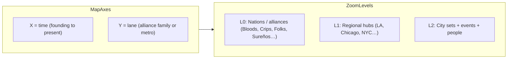
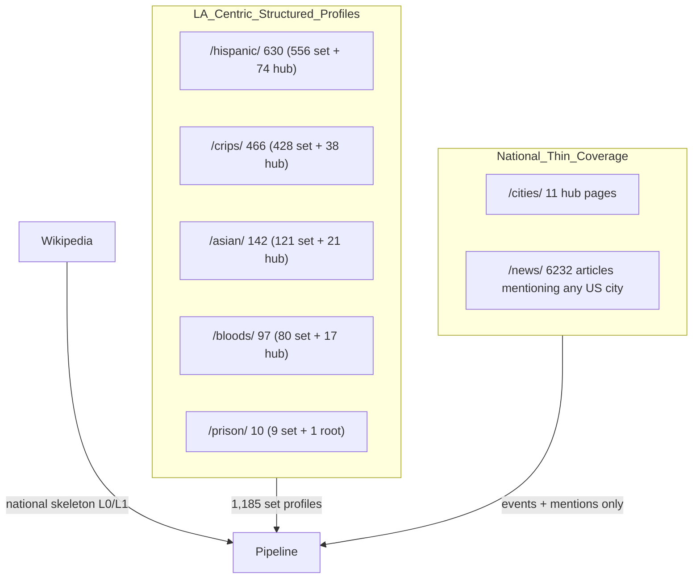
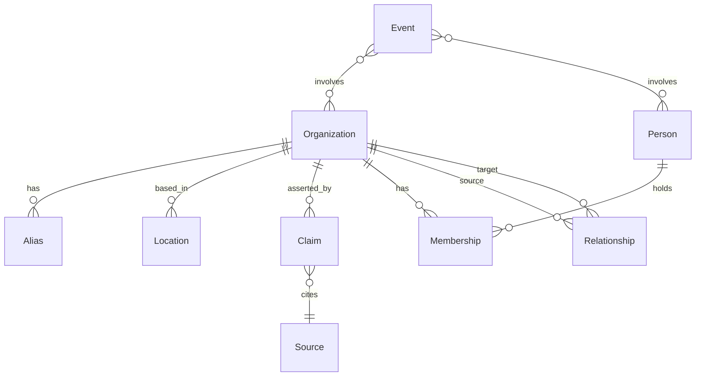
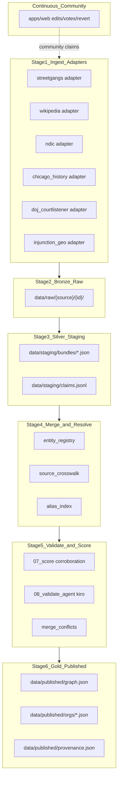
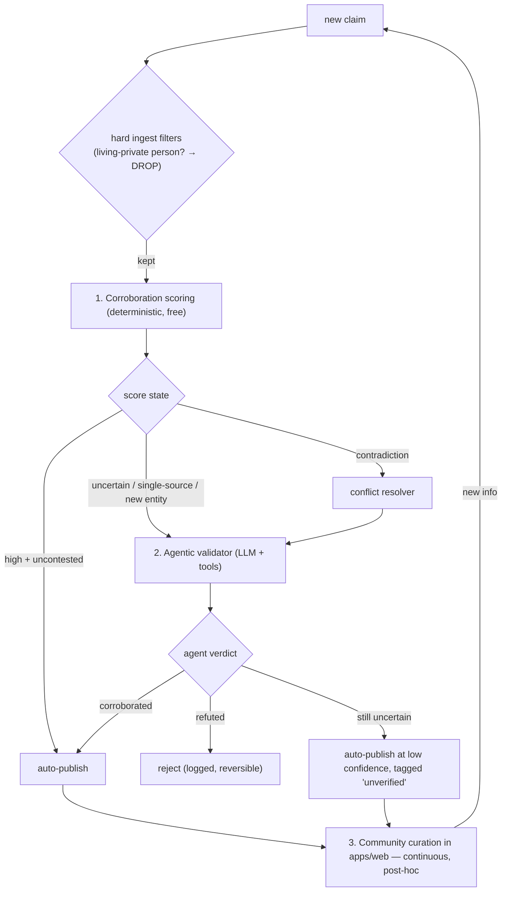
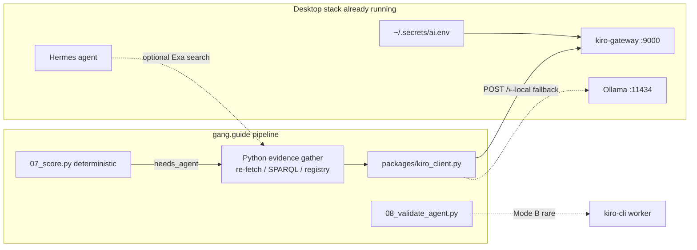
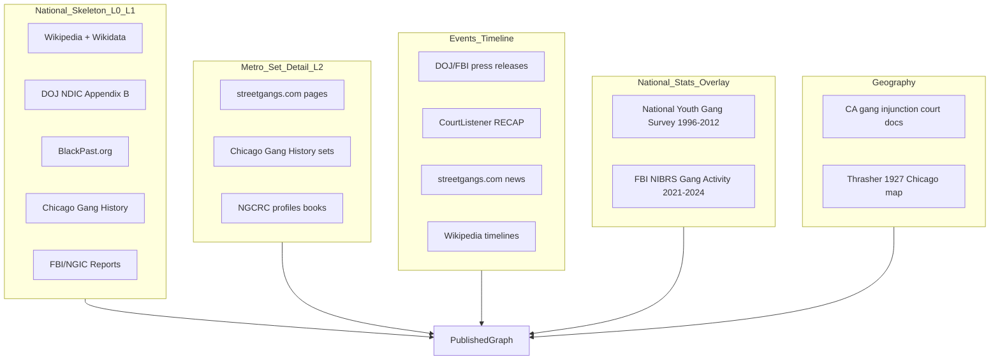
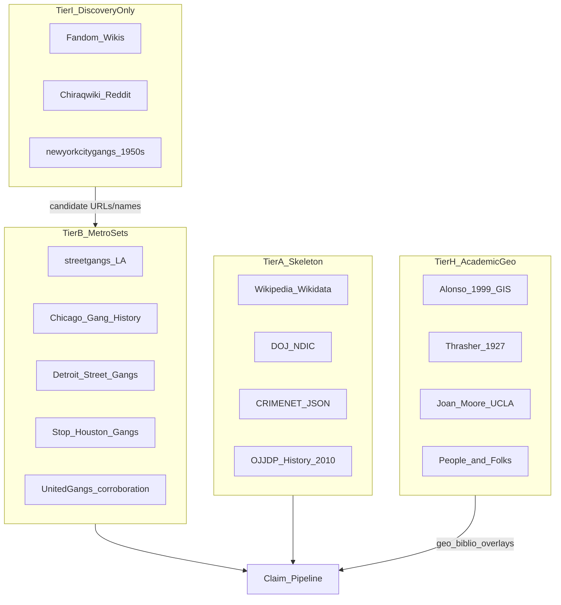
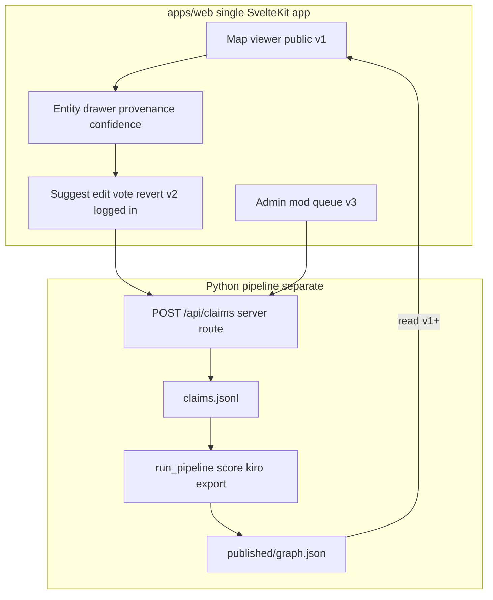

# Gang.guide — Data Platform Plan

## About the project

**gang.guide** is an interactive, evidence-backed timeline of American street gang history. The end goal is a 2D pan/zoom "map" (inspired by [musicmap.info](https://musicmap.info/) and [music.ishkur.com](https://music.ishkur.com/)) where **time runs horizontally** and **vertical lanes group alliance families and metros**, with zoom levels of detail: nations/alliances (L0) → regional hubs (L1) → city sets, people, and events (L2).

This is a **data project first, a viewer second.** No genealogy dataset for US street gangs exists publicly, so the bulk of the work is building a trustworthy data platform: ingesting many partial, conflicting sources (streetgangs.com, Wikipedia/Wikidata, DOJ/FBI reports, Chicago Gang History, CourtListener, CRIMENET, news archives), reducing each to atomic **claims** with evidence and provenance, cross-merging those claims into canonical entities via a SQLite registry, and **validating them autonomously** before publishing a provenance-backed `graph.json`.

**Validation is agentic + crowd-sourced, not owner-gated.** The owner does not hand-review the data. Instead: (1) **deterministic corroboration scoring** validates the cheap bulk; (2) **kiro-gateway** acts as curator for uncertain/conflicting claims; (3) **community curation** happens inline in the web app — logged-in users suggest edits, vote, and revert on the entity they're viewing; every contribution re-enters the scoring pipeline as a `community` claim.

**Scope discipline:** the MVP is a **national skeleton** of ~50–150 top-level nodes, validated end-to-end, before scaling to LA sets and events. The web app ships in phases: **v1 read-only map** once `graph.json` is trustworthy; **v2/v3 community features** when writes are ready — not a separate app.

**Guiding principles:** merge claims (not raw records); every fact carries a source and a computed confidence score; validation is automated (scoring + kiro agent) with community correction in `apps/web`, not owner review; trust is per-field; `registry.db` is rebuildable; `decisions.jsonl` is durable; living private persons are dropped at ingest — non-negotiable.

### Document map

| Section | What it covers |
|---------|----------------|
| [About](#about-the-project) | Project goal, validation model, scope |
| [Sitemap audit](#streetgangscom-sitemap-audit-june-18-2026) | streetgangs.com URL taxonomy (42k URLs) |
| [Data model](#core-data-model) | Organization, Claim, Relationship, etc. |
| [Pipeline](#unified-ingest--cross-merge-pipeline) | Adapters → merge → score → kiro → export |
| [Tooling](#tooling-stack-mass-ingest-search-connections-analysis) | httpx, trafilatura, kiro-gateway, FTS5, Gephi |
| [External sources](#external-data-sources-web-research) | Tier A–I source catalog (+ [pass 2 deep dive](#additional-sources--web-research-pass-2-june-2026)) |
| [Phase 1–3](#phase-1--national-skeleton-manual-seed-2-weeks) | Skeleton seed, streetgangs adapter, more adapters |
| [Phase 4 apps/web](#phase-4--web-app-appsweb--viewer--community-in-one-place) | Map v1 → community v2/v3 |
| [Risks](#risks-and-guardrails) | Person filter, licensing, agent hallucination |
| [Build order](#suggested-build-order) | Canonical implementation sequence (13 steps) |

## Recommendation: timeline layout (for apps/web map)

Do **not** choose purely vertical *or* purely horizontal. Both reference sites use a **2D pan/zoom map**:


| Site                                          | Time axis                               | Category axis                     | Why it works                                           |
| --------------------------------------------- | --------------------------------------- | --------------------------------- | ------------------------------------------------------ |
| [musicmap.info](https://musicmap.info/)       | **Vertical** (past top → future bottom) | Horizontal = super-genre families | Great for reading chronology while scanning categories |
| [music.ishkur.com](https://music.ishkur.com/) | **Horizontal** (~300px/year)            | Vertical = genre lanes            | Feels like exploring a map; deep links by coordinates  |


**For gang history**, use the Ishkur-style model at national scale:




- **National skeleton (your MVP scope)** = L0 + thin L1 nodes only (~50–150 entities, not thousands of sets).
- Detail from streetgangs.com fills **L2** over time via the curation pipeline.
- Defer **apps/web v1** until `data/published/` has a validated national skeleton.

---

## Streetgangs.com sitemap audit (June 18, 2026)

Full index at `[sitemap.xml](https://www.streetgangs.com/sitemap.xml)` — **42,042 unique URLs** across 46 sub-sitemaps (Google Sitemap Generator on WordPress). Generated daily; `robots.txt` allows crawling (only blocks `/cgi-bin/`, `/wp-content/plugins/`).

### Sitemap breakdown


| Sub-sitemap                   | URLs       | What it contains                                                       |
| ----------------------------- | ---------- | ---------------------------------------------------------------------- |
| `post_tag-sitemap*.xml` (×32) | **31,025** | Tag archive pages — cross-reference index, not primary structured data |
| `post-sitemap*.xml` (×9)      | **8,843**  | WordPress **Posts** — news, features, videos, police, hip-hop          |
| `page-sitemap*.xml` (×2)      | **1,807**  | WordPress **Pages** — gang profiles, hubs, prison gangs, cities, store |
| `archives-sitemap.xml`        | 343        | Monthly archive indexes (1984–2026)                                    |
| `category-sitemap.xml`        | 22         | Section/category landing pages                                         |
| `sitemap-misc.xml`            | 2          | Homepage + HTML sitemap                                                |


### Content tiers (what to ingest, in priority order)

**Tier 1 — Gang profile pages (1,185 set-level + ~150 hub pages)**
> Count note: the tier table below counts **set-level pages only**; the geographic diagram counts **set + hub pages** per root (e.g. `/hispanic/` = 556 set + 74 hub ≈ 630). The 1,807 total `page-sitemap` pages = ~1,185 set + ~150 hub + the remainder (prison, `/cities/`, `/store/`, `/resources/`, root-level reports).
All gang set pages live in `page-sitemap`, NOT `post-sitemap`. URL taxonomy:


| Root         | Set pages | Hub cities/areas                              | Geographic focus                                         |
| ------------ | --------- | --------------------------------------------- | -------------------------------------------------------- |
| `/hispanic/` | 556       | 74 (e.g. `cityofla`, `compton`, `18thstreet`) | LA County / SoCal                                        |
| `/crips/`    | 428       | 38 (e.g. `compton`, `longbeach`, `hoovers`)   | LA County / SoCal                                        |
| `/asian/`    | 121       | 21 (e.g. `longbeach`, `gardena`)              | LA County / SoCal                                        |
| `/bloods/`   | 80        | 17 (e.g. `inglewood`, `compton`, `pirus`)     | LA County / SoCal                                        |
| `/prison/`   | 9 sets    | 1 root                                        | National prison gangs (Mexican Mafia, NF, AB, BGF, UBN…) |


Path depth = taxonomy depth: `/bloods/inglewood/cmg/` = alliance → city → set. Hispanic pages go deepest (up to depth 5).

**Tier 2 — Events & timeline material (8,843 posts)**


| Section                           | Posts       | Data value                                                              |
| --------------------------------- | ----------- | ----------------------------------------------------------------------- |
| `/news/`                          | 6,232       | Dated incidents, indictments, policy — link to orgs via tags            |
| `/features/`                      | 428         | Long-form interviews, historical essays (e.g. 1987 Santana Blocc Crips) |
| `/injunctions/`                   | 151 (pages) | Gang injunction events with dates and named sets                        |
| `/police/`                        | 590         | Law enforcement actions, Rampart, gang units                            |
| `/video-clips/`                   | 449         | Video metadata + gang names in titles                                   |
| `/hip-hop/`                       | 864         | Cultural cross-links (lower priority for genealogy)                     |
| `/legal/`, `/politics/`, `/race/` | ~195        | Policy and legal context                                                |


**Tier 3 — National hub pages (thin structured coverage)**
`/cities/` has only **11 pages**: Chicago, NYC, Boston, Oakland, SF, Newark, Sacramento, San Diego, Santa Ana, LA homicides. These are **news index hubs** (900–1,300 gang-related links each), NOT set-profile taxonomies like LA. National metro skeleton must come from Wikipedia/academic sources, with streetgangs.com news posts filling event timeline.

**Tier 4 — Reference material**

- `/store/books/` — 42 bibliographic entries (gang history books)
- Root-level reports: `conn-threat-assessment-gang-2003`, `dianne-feinstein-report-2003`, `national-alliance-gang-report-2005`, `041908jamiels-law`
- `/resources/` — 12 utility pages

**Tier 5 — Skip for structured graph (archive only)**

- **31,025 tag pages** — useful as inverted index (~926 gang-name tags) but redundant with post content; ingest tag→post mappings, not tag pages themselves
- `/contact/` — 60 contributor/interview profiles
- `/store/` merch, `/lies/`, `/photos/` — low genealogy value

### Critical geographic limitation




**Implication for plan:** streetgangs.com is the primary source for **LA-area L2 set detail** and **national event timeline** (via news), but NOT for a complete national gang taxonomy. The national skeleton seed must be Wikipedia/academic; streetgangs.com enriches LA sets and provides dated events nationwide.

---

## What a gang profile page actually gives us

A page like [CMG / Inglewood](https://www.streetgangs.com/bloods/inglewood/cmg/) mixes high-value structured narrative with noise:

**Extractable (curator-grade):**

- Canonical name + aliases (`CMG`, `CMGB`, `CMG 104th Street`)
- Parent/spin-off (`spin-off of Inglewood Family Gang in 1981`)
- Location (`Inglewood, LA County`; turf description)
- Demographics (`predominately African-American`)
- Dated events (`1997 gang injunction`, gentrification context)
- Government source quotes (with URL to original doc)
- Deceased members list (names, dates, circumstances)
- Related-post links → implicit relationships (IFG, NHP, Denver CMGB)

**Not extractable as facts (archive only):**

- Comment threads (unverified claims, e.g. “CMGB in Denver harder than Inglewood”)
- Sidebar taxonomy (useful for **crawl discovery**, not as ground truth)

The CMG article body is ~1 paragraph of facts + lists + thousands of comments — so ingestion must separate **article body** from **comments** and route facts through the validation engine (scoring → agent → community).

---

## Core data model

Adapt proven patterns from [CRIMENET](https://github.com/alvarofrancomartins/CRIMENET) (evidence-backed nodes/edges) and extend for US street gangs.

### Entity layers (national skeleton)




`**Organization**` (gang, nation, car, set, faction):

- `id` (stable slug), `standard_name`, `aliases[]`, `original_text_names[]`
  - **Slug disambiguation rule:** slugs collide (multiple `Latin Kings`, many `* Street`). Disambiguate with metro/parent suffix — `org:latin-kings-chicago` vs `org:latin-kings-nyc`, `org:18th-street-la`. Never reuse a bare colliding slug.
- `type`: `nation | alliance | car | set | faction | prison_gang | other`
- `ethnicity`, `colors`, `symbols` (optional, sourced)
- `founded_year`, `dissolved_year` (nullable ints), `status`: `active | defunct | unknown`
- `founded_year_precision`: `exact | circa | decade | range` (+ optional `founded_year_latest` for ranges) — founding dates in gang history are frequently disputed/approximate; the timeline X-axis must render uncertainty, not fake precision
- `description` (agent- or community-authored summary; editable inline in apps/web entity drawer)
- `detail_level`: `skeleton | profiled | mention_only` (national MVP = mostly `skeleton`)
- `map_hint`: `{ lane, x_year }` for apps/web map placement (manual at skeleton stage)

`**Person`**: name, aliases, birth/death years, bio, memberships with date ranges.

`**Relationship**` (every edge requires evidence):

- `type`: `spin_off | parent_set | offspring | alliance | rivalry | truce | migration | merger | split | car_affiliation | influence | other`
- `source_id`, `target_id`
- `time_start`, `time_end` (nullable)
- `evidence[]`: `{ quote, source_url, source_title, accessed_at, validation_status }`

`**Event**`: injunctions, indictments, homicides, formations; linked orgs/people; dated.

`**Location**`: city, state, neighborhood, optional geo coordinates; `kind`: `turf | origin | migration | presence`.

`**Source**`: URL, title, fetch timestamp, content hash, `license` (CC-BY-SA / copyrighted-excerpt / open), `source_type`: `streetgangs | wikipedia | government | academic | news | community | agent_validation`.

`**Claim**`: atomic fact awaiting or after review — `{ subject, predicate, object, confidence, review_status }`.

`**Claim**` — the atomic unit of merge (never merge raw source records directly):

```jsonc
{
  "id": "claim:uuid",
  "entity_type": "organization",       // organization | person | relationship | event | location
  "predicate": "founded_year",         // schema-defined field or relationship type
  "value": 1981,
  "subject_ref": "mention:cmg",        // unresolved mention OR canonical entity id
  "object_ref": "mention:ifg",         // for relationships
  "source_id": "streetgangs:.../cmg/",
  "evidence_quote": "spin-off of Inglewood Family Gang in 1981",
  "confidence": "strong",              // discrete tier: exact | strong | weak | none
  "review_status": "pending"           // pending | auto_published | unverified | needs_agent | conflict | rejected | superseded
}
```

`**EntityRegistry` entry** — canonical identity after resolution:

```jsonc
{
  "canonical_id": "org:crenshaw-mafia-gang",
  "standard_name": "Crenshaw Mafia Gang",
  "detail_level": "profiled",
  "crosswalk": [
    {"source": "streetgangs", "key": "bloods/inglewood/cmg", "url": "..."},
    {"source": "wikidata", "key": "Q????"},
    {"source": "ndic", "key": null}
  ],
  "aliases": ["CMG", "CMGB", "CMG 104th Street"],
  "merged_from": ["mention:cmg", "mention:cmgb"]   // audit trail
}
```

Store machine-readable schema in `[packages/schema/](packages/schema/)` (JSON Schema) and validate with Pydantic in the Python pipeline.

---

## Unified ingest + cross-merge pipeline

The core problem: **12+ sources describe the same gangs with different names, granularities, and trust levels**. The pipeline must ingest each source independently, normalize to a common claim format, resolve mentions to canonical entities, merge without losing provenance, score for corroboration, and route only the uncertain/conflicting claims to the agentic validator and community.

### Architecture overview




### Data layers (medallion)


| Layer         | Path                          | Contents                                                                         | Immutable?                                                  |
| ------------- | ----------------------------- | -------------------------------------------------------------------------------- | ----------------------------------------------------------- |
| **Bronze**    | `data/raw/{source}/{id}/`     | Original HTML/PDF/JSON + `meta.json` (hash, fetched_at, url)                     | Append-only; re-fetch only if hash changes                  |
| **Silver**    | `data/staging/bundles/`       | Per-source `SourceBundle` JSON — mentions, claims, unresolved refs               | Versioned per content_hash                                  |
| **Silver**    | `data/staging/claims.jsonl`   | Flattened claim stream from all bundles (for batch processing)                   | Append + supersede                                          |
| **Decisions** | `data/review/decisions.jsonl` | Durable, diffable decisions from **agent + community + owner** (validate/reject/merge/split/conflict winner/revert) | Append-only; **git-tracked source of truth** |
| **Merge hub** | `data/merge/registry.db`      | SQLite: entities, aliases, crosswalk, conflicts, FTS index                       | **Derived cache — NOT source of truth**                     |
| **Gold**      | `data/published/`             | Validated canonical graph (scored/agent-published) + full provenance map         | Versioned exports (`graph@v3.json`)                         |


**Source-of-truth boundary (critical):** `registry.db` is a binary blob that cannot be diffed or code-reviewed. It is treated as a **derived cache** rebuildable from `data/seeds/` + `data/staging/claims.jsonl` + `data/review/decisions.jsonl`. Agent, community, and owner decisions append to the git-tracked `decisions.jsonl`. `rebuild_registry.py` must reproduce the DB deterministically from these three inputs.

### Stage 1 — Source adapters (one per source, common interface)

Every adapter implements `packages/schema/adapter.py`:

```python
class SourceAdapter(Protocol):
    source_type: str
    def discover(self) -> list[SourceRef]: ...      # URLs, files, API cursors
    def fetch(self, ref: SourceRef) -> RawArchive: ...
    def parse(self, raw: RawArchive) -> SourceBundle: ...
```


| Adapter module                | Input                           | SourceBundle output                                                |
| ----------------------------- | ------------------------------- | ------------------------------------------------------------------ |
| `adapters/streetgangs.py`     | page/post HTML                  | org mentions, set claims, events, internal link edges              |
| `adapters/wikipedia.py`       | MediaWiki API + Wikidata SPARQL | org claims, QID crosswalk, founding dates; **scope filter** per Gang article audit (US street/prison/nation only) |
| `adapters/ndic.py`            | Appendix B HTML sections        | L0/L1 org profiles (high-trust bootstrap)                          |
| `adapters/chicago_history.py` | CGH pages                       | Chicago sets, Folk/People member lists, hood locations             |
| `adapters/doj_press.py`       | justice.gov RSS/HTML            | dated events, named org mentions                                   |
| `adapters/courtlistener.py`   | RECAP API                       | RICO enterprise structure, clique→nation hierarchy, predicate acts |
| `adapters/injunctions.py`     | court doc lists + geo           | turf polygons, named gangs, injunction dates                       |
| `adapters/manual_seed.py`     | `data/seeds/*.json`             | owner-seeded canonical entities (highest trust)                      |
| `adapters/crimenet.py`        | `crimenet.json`                 | bootstrap L0 orgs + crosswalk from Wikipedia-extracted graph         |
| `adapters/gdelt.py`            | GDELT DOC API                   | national news event candidates by keyword                            |
| `adapters/mediacloud.py`       | MediaCloud API                  | US news events by metro/gang name                                    |


Adapters **never write to the published graph**. They only emit `SourceBundle` + `Claim` records.

### Stage 2 — Normalize mentions before merge

Each `SourceBundle` contains **mentions** (unresolved surface forms) separate from **claims** (facts about those mentions):

```
mention:cmg          → "Crenshaw Mafia Gang" | aliases: [CMG, CMGB] | hints: {city: Inglewood, parent: bloods}
mention:inglewood-ifg → "Inglewood Family Gang" | hints: {city: Inglewood, parent: bloods}
claim:001            → subject: mention:cmg, predicate: founded_year, value: 1981, source: streetgangs:...
claim:002            → subject: mention:cmg, predicate: parent_set, object: mention:inglewood-ifg, source: streetgangs:...
```

Normalization steps (`04_normalize.py`):

- Strip gang suffix noise (`Gang`, `Street`, `Locos`, `Varrio`)
- Lowercase + punctuation fold for alias index
- Expand known abbreviations (`IFG` → check registry)
- Attach `location_hint` and `parent_nation_hint` from URL path or article context

### Stage 3 — Entity resolution (match mentions → canonical IDs)

`05_resolve_entities.py` runs in priority order; first confident match wins, ambiguous routes to the agentic validator (then community). Match confidence is expressed as **discrete tiers** (`exact | strong | weak | none`) rather than hand-assigned floats — float "scores" imply a calibration we do not have. (This is the *identity* axis — "same entity?" — separate from the *truth* corroboration score in Stage 5.):


| Step | Match type                      | Example                                                      | Tier → action         |
| ---- | ------------------------------- | ------------------------------------------------------------ | --------------------- |
| 1    | **Crosswalk hit**               | `streetgangs:bloods/inglewood/cmg` already mapped            | `exact` → auto-merge  |
| 2    | **Wikidata QID**                | `wikidata:Q94270` on both bundles                            | `exact` → auto-merge  |
| 3    | **Exact alias + location**      | `CMG` + `Inglewood, CA` in registry                          | `strong` → auto-merge |
| 4    | **Exact standard_name**         | `Crenshaw Mafia Gang` normalized match                       | `strong` → auto-merge |
| 5    | **Fuzzy name + parent + metro** | `Crenshaw Mafia Gangster Bloods` under `bloods` in Inglewood | `weak` → agent validator |
| 6    | **No match**                    | Create new `canonical_id`; status `unresolved`               | `none`                |


(If float scoring is reintroduced later, thresholds must be calibrated against the golden eval set — see Evaluation harness below — never hand-picked.)

**Dependency ordering — resolve to a fixpoint, not a single pass.** A relationship claim like `CMG --parent_set--> mention:ifg` cannot resolve until IFG exists as a canonical entity. Single-pass resolution leaves dangling edges. The resolver therefore:

1. Resolves all **entity mentions** to canonical IDs first (steps 1–6).
2. Re-links **relationship/event targets** in a second pass against the now-updated registry.
3. Unresolvable targets go to a **deferred-link queue**; resolution re-runs after each new source ingest until no new links resolve (fixpoint). This handles parent-before-child and cross-source forward references.

Output: `entity_resolution.jsonl` — `{ mention_id, canonical_id, match_tier, match_method, review_required }`

**Alias registry** is the critical shared index — seeded from national skeleton, grown as sources are ingested:

```
alias_index:
  "cmg"           → [org:crenshaw-mafia-gang]
  "crenshaw mafia gang" → [org:crenshaw-mafia-gang]
  "18th street"   → [org:18th-street-gang]   # disambiguate by location if multiple
```

When one alias maps to **multiple** canonical entities (e.g. `Latin Kings` Chicago vs NYC), require `location_hint` or `parent_nation_hint` to disambiguate — otherwise → conflict queue.

### Stage 4 — Cross-source merge engine

`06_merge.py` materializes canonical entities by grouping claims per entity+field; the **published value per field is the one selected by Stage 5 scoring/validation** (a claim's `review_status` reaches `auto_published`/`unverified`). **Merge by claim, not by record** — this is how we cross-merge streetgangs + Wikipedia + DOJ without losing source fidelity. ("Published claim" below = a claim whose status is published, i.e. it passed scoring or agent validation.)

**Merge rules by field type:**


| Field type                               | Merge strategy                                                                                                                 | Conflict handling                                        |
| ---------------------------------------- | ------------------------------------------------------------------------------------------------------------------------------ | -------------------------------------------------------- |
| **Aliases, locations, source URLs**      | Union of all published claims                                                                                                  | None — accumulate                                        |
| **Relationships, events**                | Keep one edge per source claim (CRIMENET model); dedupe only if same source+quote                                              | Display-time grouping                                    |
| **founded_year, dissolved_year, status** | Single value; pick winner via **per-predicate** trust matrix + corroboration score                                            | If 2+ published claims disagree → `merge_conflicts` → agent |
| **description**                          | Agent/community-authored prose; sources populate `claim` evidence, not final prose; editable inline in apps/web | Suggest-edit + revert in entity drawer                   |
| **detail_level**                         | Highest reached, ordered `mention_only < skeleton < profiled`                                                                  | —                                                        |
| **parent_set / nation affiliation**      | Require ≥1 published claim; resolve via **per-predicate** trust matrix (street_specialist outranks government for `parent_set`) | Conflicts → agent                                       |


**Source trust is PER-PREDICATE, not global.** A single global ranking is wrong: federal/legal sources are authoritative for *legal facts* (charges, enterprise structure, dates of indictment) but are frequently **wrong or oversimplified on genealogy** — the CMG example below shows a DOJ indictment mislabeling a Blood set as "a Crips subunit." Street-specialist sources (streetgangs.com, Chicago Gang History) are often **more** reliable for `parent_set`, `founded_year`, and `aliases`. Encode trust as a `(predicate → ranked sources)` matrix:


| Predicate / field                                                        | Trust ranking (highest first)                                                                            |
| ------------------------------------------------------------------------ | -------------------------------------------------------------------------------------------------------- |
| `founded_year`, `parent_set`, `spin_off`, `aliases`                      | manual_seed → street_specialist (streetgangs/chicago_history) → academic → wikipedia → government → news |
| `charges`, `rico_enterprise`, `indictment_date`, `member_count_estimate` | manual_seed → government/legal → academic → news → wikipedia → street_specialist                         |
| `colors`, `symbols`, `turf`, `ethnicity`                                 | manual_seed → street_specialist → academic → wikipedia → government → news                               |
| `nation_affiliation`                                                     | manual_seed → academic → street_specialist → government → wikipedia → news                               |
| `event` (dated incidents)                                                | manual_seed → government/legal → news → street_specialist → wikipedia                                    |


Community trust is reputation-weighted (`trusted` users > `new` users) and starts low until corroborated or up-voted. `agent_validation` records are signals, not a source of new facts. `mention_only` (tag co-occurrence, unverified) is never auto-trusted for any field — it only suggests candidate edges. A later record (agent, community, or owner) overrides an earlier one via the same trust + recency rules; the owner's arbitration is just the highest-trust signal, not a mandatory gate.

**Cross-merge example — CMG across sources:**

```
streetgangs.com  → founded 1981, parent IFG, turf Inglewood, aliases [CMG, CMGB]
Wikipedia        → (may not have set-level article; links to Bloods nation)
DOJ indictment   → "subunit of the Crips national street gang" (different set — skip)
NDIC Bloods      → national profile only; no CMG
Chicago History  → (no CMG — different metro)

Merge result:
  org:crenshaw-mafia-gang
    founded_year: 1981        ← streetgangs claim (published; top-trust for this field); no conflict
    parent: org:inglewood-family-gang  ← streetgangs claim; IFG must resolve first
    nation: org:bloods        ← inferred from URL path + NDIC Bloods profile
    aliases: [CMG, CMGB, CMG 104th Street]  ← union
    sources: [streetgangs:..., ndic:bloods, ...]  ← all contributing sources
```

### Stage 5 — Autonomous validation, scoring & publishing

**Model: agents validate and publish by default; the community corrects after the fact; the owner is hands-off.** There is no human-gates-everything step. A claim's `review_status` is decided by a **validation engine** combining three signal sources, in cost order (cheap → expensive):



**Important:** maximum autonomy means **everything that survives the hard ingest filters can auto-publish** — including new entities and Person nodes — because **community curation in apps/web** (revert + edit history) is the correction mechanism, not a pre-publish human. The **only** absolute, non-overridable block is the deterministic **living-private-person filter** (see Risks): such records are dropped at ingest and never become claims, so autonomy can't reintroduce them.

#### 1. Corroboration scoring (the cheap bulk of validation — `07_score.py`)

A computed, **non-arbitrary** confidence score per claim (distinct from the resolution *match tier* in Stage 3 — that axis answers "same entity?"; this axis answers "is the fact true?"). Built from countable signals:

| Signal | Contribution |
|--------|-------------|
| **Per-predicate source trust** (Stage 4 matrix) | Base weight of the asserting source for *this* field |
| **Independent corroboration count** | +N for each *independent* source (different `source_type`/domain) asserting the same value; this is the main lever |
| **Agreement vs contradiction** | Agreeing sources raise; a contradicting claim opens a conflict and caps the score |
| **Source recency / versioning** | Newer authoritative versions outweigh stale ones |
| **Community votes** (once live) | Reputation-weighted up/down votes nudge the score |

Score → state thresholds (tunable against `tests/golden/` — calibrate at implementation, don't hand-pick):

**Starter formula (v0):** `confidence = base_trust(predicate, source) + 0.15 × independent_corroborations − contradiction_penalty`

| `base_trust` (per-predicate matrix rank) | Value |
|------------------------------------------|-------|
| `manual_seed` | 0.95 |
| top rank for this predicate | 0.75 |
| mid rank | 0.55 |
| `mention_only` / `community` (unvoted) | 0.25 |

| Result | Route |
|--------|-------|
| ≥ 0.85, no contradiction | `auto_published` |
| 0.50–0.84, or single-source new entity | `needs_agent` → kiro |
| contradicting claim on single-valued field | `conflict` → kiro (sonnet) then community |
| agent refutes | `rejected` (logged, reversible) |
| agent uncertain | `unverified` (published, tagged) |

Most claims with ≥2 independent agreeing sources never touch kiro.

#### 2. Agentic validator (`08_validate_agent.py`) — handles what scoring can't

Uses **kiro-gateway** (`127.0.0.1:9000`) — the same local Anthropic-compatible proxy already running on your desktop for `~/Jobs` scoring and Hermes. No Cursor SDK or paid API keys needed; it routes through Amazon Q Developer Pro via `kiro-cli`.

**Two validation modes:**

| Mode | When | How |
|------|------|-----|
| **A — Evidence-in-prompt** (default) | Most `needs_agent` claims | Python gathers evidence deterministically (re-fetch cited source, Wikidata SPARQL, registry lookup, GDELT keyword check), packs it into the prompt, calls kiro-gateway `/v1/messages`, parses structured `ValidationRecord` JSON. Same pattern as [`~/Jobs/src/jobs_pipeline/score.py`](~/Jobs/src/jobs_pipeline/score.py) `_call_kiro()`. |
| **B — kiro-cli worker** (complex) | Multi-hop web exploration, ambiguous conflicts | `kiro-cli chat --no-interactive --trust-all-tools` with `workdir` set to project root — same as Hermes [`kiro-worker`](~/dotfiles/hermes/skills/kiro-worker/SKILL.md) skill. Use sparingly; budget-capped. |

For each claim the validator:
- Runs Mode A tools first (Python-side, free except kiro inference): re-fetch source URL, query Wikidata, check registry for corroborating claims, optional Exa web search if `EXA_API_KEY` set (Hermes already has this).
- Calls kiro-gateway with a strict JSON-schema prompt; model **`claude-haiku-4.5`** for bulk, **`claude-sonnet-4.6`** for conflicts.
- Emits a `ValidationRecord`: `{ claim_id, verdict: corroborate|refute|uncertain, evidence_found[], sources_checked[], confidence_delta, model, cost_tokens }`, appended to `data/review/decisions.jsonl`.
- **Verdict → action:** corroborate → publish; refute → reject (logged); uncertain → auto-publish tagged `unverified`.

**kiro-gateway client** — extract a shared `packages/kiro_client.py` from the Jobs pattern:

```python
# Mirrors ~/Jobs/src/jobs_pipeline/score.py — do not duplicate logic ad-hoc
KIRO_GATEWAY_URL = os.environ.get("KIRO_GATEWAY_URL", "http://127.0.0.1:9000")
# Key from ~/.secrets/ai.env: KIRO_GATEWAY_API_KEY or PROXY_API_KEY
# POST {url}/v1/messages  headers: x-api-key, anthropic-version: 2023-06-01
# Retries on 429/timeout; cache verdicts by content_hash
```

**Runtime requirements** (already on your desktop via dotfiles):
- `systemctl is-active kiro-gateway` — systemd service, `modules/ai/kiro-gateway.nix`
- Keys in `~/.secrets/ai.env` (loaded via direnv or `scripts/` wrapper)
- Health check: `curl -fsS http://127.0.0.1:9000/health`
- `--local` fallback to Ollama (`:11434`) if kiro is down — same as Jobs `--local` flag

Cost guardrails: scoring runs first and resolves the majority for free; kiro only fires on `needs_agent`/`conflict` claims; results cache by `content_hash`; `--no-agent` skips kiro entirely; `--agent-budget N` caps calls per run.

#### 3. Conflict resolution

`merge_conflicts` opens when:
- Two claims disagree on a single-valued field (founded 1981 vs 1982)
- One alias maps to multiple canonical entities without disambiguation
- `parent_set` cycle detected (A → B → A)
- A set is claimed under conflicting nations

Conflicts are routed to the **agentic validator first** (it weighs per-predicate trust + corroboration and picks a winner, recording why); unresolved or low-confidence conflicts surface in the community queue. The owner sees only an optional escalation digest — never a mandatory queue.

#### 4. Community curation (inline in `apps/web`, not a separate app)

Crowd correction happens **on the map you're already viewing** — click a node, open the detail drawer, suggest an edit. Account-gated + reputation-weighted:

- **Anyone can browse** the map and read provenance; **editing/voting requires an account**.
- **New users' edits queue** for agent validation or trusted-user approval; **trusted users** get low-risk edits auto-merged.
- Every edit/vote hits a **SvelteKit server route** that appends a `community` claim to `claims.jsonl` and optionally triggers `run_pipeline.py` — it does **not** bypass scoring/provenance.
- **Affordances in the entity drawer:** per-field "suggest edit", edit history + diffs, one-click revert, up/down vote on disputed fields, talk/discussion tab, flagging; `/admin` mod queue for moderators.
- Reputation + rate limits + the absolute person-filter mitigate vandalism (see Risks).

Net effect: you (`manual_seed`) only seed and occasionally arbitrate; **agents + scoring + the community do the curation** — all through one web app.

### Stage 6 — Export published graph

`09_export.py` builds gold layer from merge hub:

- `graph.json` — nodes (orgs, people, events) + edges (relationships) with `canonical_id` only
- `orgs/{canonical_id}.json` — full entity with all published field values + per-field confidence
- `provenance.json` — map of `{ canonical_id → { field → [claim_id, source_id] } }` for audit
- `crosswalk.json` — all source keys → canonical_id (for re-ingestion idempotency)

Re-running ingest is **idempotent**: same `content_hash` → skip re-parse; changed hash → new bundle version → re-resolve → re-merge only affected entities.

### Orchestrator

`run_pipeline.py` runs stages in order, stops on first failure:

```
0. discover + fetch (all enabled adapters)
1. parse → SourceBundles  (+ apply hard ingest filters, e.g. living-private-person drop)
2. normalize mentions
3. resolve entities (fixpoint, against current registry)
4. merge → update registry.db
5. score claims (corroboration) + detect conflicts
6. agentic validation of needs_agent / conflict claims → publish/reject/unverified
7. export published graph
(continuous, out-of-band: community edits/votes from `apps/web` server routes re-enter as claims at step 0)
```

Flags: `--only streetgangs`, `--skip-fetch`, `--dry-run`, `--force-remerge`, `--no-agent` (scoring only), `--agent-budget N`.

### Updated repository layout

```
gang.guide/
├── pyproject.toml
├── packages/
│   ├── schema/                 # JSON Schema + Pydantic models
│   ├── kiro_client.py          # kiro-gateway httpx client (pattern from ~/Jobs/score.py)
│   └── adapters/               # SourceAdapter implementations
│       ├── base.py
│       ├── streetgangs.py
│       ├── wikipedia.py
│       ├── ndic.py
│       ├── chicago_history.py
│       ├── doj_press.py
│       ├── courtlistener.py
│       ├── crimenet.py
│       ├── gdelt.py
│       ├── mediacloud.py
│       └── manual_seed.py
├── tests/
│   └── golden/                 # known entities, alias folds, should-NOT-merge traps
├── pipeline/                   # single coherent 00–10 stage scheme
│   ├── run_pipeline.py         # orchestrator
│   ├── 00_discover.py          # all adapters discover
│   ├── 01_fetch.py             # all adapters fetch → bronze
│   ├── 02_parse.py             # all adapters parse → silver bundles
│   ├── 03_extract_claims.py    # optional NLP-assisted claim extraction (off by default)
│   ├── 04_normalize.py         # mention normalization
│   ├── 05_resolve_entities.py  # mention → canonical_id (fixpoint, deferred-link queue)
│   ├── 06_merge.py             # claim-based cross-source merge (per-predicate trust)
│   ├── 07_score.py             # corroboration scoring + conflict detection (deterministic, free)
│   ├── 08_validate_agent.py    # agentic validator (LLM + tools) for uncertain/conflict claims → decisions.jsonl
│   ├── 09_export.py            # gold layer export (+ GEXF for Gephi)
│   ├── owner_digest.py         # OPTIONAL escalation digest for owner (not a mandatory queue)
│   └── rebuild_registry.py     # deterministically rebuild registry.db from seeds+claims+decisions+community
├── apps/
│   └── web/                    # single SvelteKit app — map viewer + inline community curation (phased v1→v3)
│       ├── routes/             # map, entity drawer, auth, /api/claims (writes), /admin (mod)
│       └── lib/                # PixiJS/OpenLayers map, graph loader
├── data/
│   ├── seeds/                  # manual bootstrap (highest trust)
│   ├── raw/{source}/{id}/      # bronze
│   ├── staging/
│   │   ├── bundles/            # silver SourceBundles
│   │   └── claims.jsonl        # flattened claim stream
│   ├── review/
│   │   └── decisions.jsonl     # durable agent/community/owner decisions (source of truth)
│   ├── merge/
│   │   └── registry.db         # SQLite merge hub (derived cache)
│   └── published/              # gold exports
```

### SQLite merge hub schema (essential tables)


| Table             | Purpose                                                                         |
| ----------------- | ------------------------------------------------------------------------------- |
| `entities`        | `canonical_id`, `entity_type`, `standard_name`, `detail_level`, `review_status` |
| `aliases`         | `alias_normalized`, `canonical_id`, `source_claim_id`                           |
| `crosswalk`       | `source_type`, `source_key`, `canonical_id` (idempotent re-ingest)              |
| `claims`          | Full claim records + `confidence_score` + `review_status` (`auto_published`/`unverified`/`rejected`/`conflict`/`needs_agent`) |
| `claim_values`    | Materialized published values per entity+field (for fast merge)                 |
| `relationships`   | `source_id`, `target_id`, `type`, `claim_id` (one row per source statement)     |
| `events`          | Dated events linked to entity IDs                                               |
| `merge_conflicts` | Contradiction records routed to agent first, then community                     |
| `validation_records` | Agent verdicts: `claim_id`, `verdict`, `evidence_found`, `sources_checked`, `cost` (mirrors decisions.jsonl) |
| `community_edits` | Community edits as claims: `user_id`, `entity_id`, `field`, `old`, `new`, `status`, `reverted_from` |
| `votes`           | `user_id`, `claim_id`/`edit_id`, `direction`, `weight` (reputation-weighted)    |
| `users`           | Community accounts: `reputation`, `role` (`new`/`trusted`/`mod`), rate-limit state |


### Incremental cross-merge workflow (how sources combine over time)

```mermaid
sequenceDiagram
  participant Seed as manual_seed
  participant NDIC as ndic_adapter
  participant Wiki as wikipedia_adapter
  participant SG as streetgangs_adapter
  participant CGH as chicago_history_adapter
  participant DOJ as courtlistener_adapter
  participant Hub as merge_hub
  participant Pub as published_graph

  Seed->>Hub: 50 L0/L1 canonical entities
  NDIC->>Hub: enrich nations + membership estimates
  Wiki->>Hub: add QIDs aliases founding dates
  Note over Hub: registry now has ~80 entities
  SG->>Hub: 1185 LA set mentions → resolve against registry
  Note over Hub: CMG resolves to new entity; Bloods matches existing
  CGH->>Hub: 90 Chicago sets → resolve Folk/People members
  DOJ->>Hub: RICO events → link sets to nations nationwide
  Hub->>Pub: export graph@v1 with full provenance
```


### Build order for merge pipeline (before scaling ingest)

See **Suggested build order** at the end of this document for the canonical sequence. Summary: schema → golden fixtures → skeleton adapters → prove cross-merge with scoring → CMG e2e → kiro validator → scale ingest → apps/web.

### Evaluation harness (entity resolution is the core risk)

Resolution/merge errors are the project's main failure mode, so they must be measured, not eyeballed. Ship a `tests/golden/` fixture set from day one:

- **Known entities** — a hand-verified set of canonical orgs with correct fields (e.g. CMG → founded 1981, parent IFG, nation Bloods).
- **Correct alias folds** — surface forms that *must* resolve together (`CMG`, `CMGB`, `CMG 104th Street` → one entity).
- **Should-NOT-merge traps** — distinct entities sharing a name that must stay separate: `Latin Kings` (Chicago) vs `Latin Kings` (NYC); the multiple `18th Street` references; Crip vs Blood sets with similar names in different metros.
- **Metric each merge run** — print resolution precision/recall and a regression diff against the last run; fail CI if a known fold breaks or a trap merges.

This also calibrates any future move from discrete tiers back to float scores.

### Observability + idempotency details

- **Per-stage metrics**: each stage logs counts in/out (mentions parsed, claims emitted, entities created, links deferred, conflicts opened) via **loguru**; written to `data/merge/run_report.json` per run.
- **Claim supersession key**: `claims.jsonl` is append-only; a claim supersedes a prior one when `(source_id, subject_ref, predicate)` matches and `content_hash` differs — the latest non-superseded claim per key wins at merge time.
- **Idempotent re-ingest**: unchanged `content_hash` → skip parse; changed hash → new bundle version → re-resolve → re-merge only affected entities.

---

## Tooling stack (mass ingest, search, connections, analysis)

Research summary: no single tool does everything. gang.guide should use a **layered toolkit** — each layer maps to a pipeline stage. Prefer lightweight, local-first, Python-native tools that fit the SQLite merge hub.

```mermaid
flowchart LR
  subgraph crawl [Crawl_and_Archive]
    httpx["httpx primary"]
    Wayback["Wayback CDX"]
    CC["news-please optional"]
    Scrapy["Scrapy fallback"]
  end
  subgraph extract [Extract_and_Parse]
    Trafilatura["trafilatura"]
    BS4["BeautifulSoup rules"]
    GLiNER["GLiNER optional"]
  end
  subgraph index [Search_and_Discover]
    FTS["SQLite FTS5"]
    GDELT["GDELT DOC API"]
    MC["MediaCloud client"]
  end
  subgraph merge_tools [Entity_Resolution]
    Dedupe["dedupe / Splink"]
    Nodecanon["nodecanon optional"]
  end
  subgraph analyze [Graph_and_Explore]
    NX["NetworkX"]
    Gephi["Gephi export"]
    Datasette["Datasette"]
    OpenRefine["OpenRefine manual"]
  end
  crawl --> extract --> index --> merge_tools --> analyze
```




### Layer 1 — Mass crawl and archive


| Tool                                                                          | Use for gang.guide                                                                                      | Why                                                                                             |
| ----------------------------------------------------------------------------- | ------------------------------------------------------------------------------------------------------- | ----------------------------------------------------------------------------------------------- |
| **[httpx](https://www.python-httpx.org/)** + asyncio + on-disk cache          | **PRIMARY crawler for v1** — streetgangs.com 42k sitemap-enumerated pages, Chicago Gang History, DOJ indexes, all API calls | Decision: sources are finite + sitemap-listed + static HTML at 1 req/sec, so a simple async fetcher keeps the `discover/fetch/parse` adapter Protocol clean. Scrapy's spider/pipeline/settings model fights that abstraction. |
| **[Scrapy](https://scrapy.org/)**                                             | **Documented fallback only** — reach for it if a *non-sitemap* source needs recursive link-following discovery | Production-scale crawl framework; introduce per-source only when httpx discovery is insufficient, not as the default |
| **[trafilatura](https://github.com/adbar/trafilatura)**                       | Extract article body from HTML (news posts, features, external articles)                                | Best-in-class main-text extraction; `sitemap_search()` for discovery; pairs with archived HTML  |
| **[Wayback CDX API](https://archive.org/developers/wayback-cdx-server.html)** | Recover dead/changed streetgangs.com pages; historical news                                             | `web.archive.org/cdx/search/cdx?url=...` + fetch with `id_` flag for clean HTML                 |
| **[news-please](https://github.com/fhamborg/news-please)**                    | Optional: mine [Common Crawl news archive](https://commoncrawl.org/) for gang-related articles at scale | Filters WARCs by publisher/date; structured JSON output; complements GDELT                      |
| **sitemap.xml parsing**                                                       | Primary discovery for streetgangs.com (already audited)                                                 | No crawler needed for URL list — httpx consumes the index                                       |


**Not recommended for v1:** Crawl4AI/Firecrawl (LLM-oriented, heavy), Playwright (streetgangs.com is static HTML), Selenium.

### Layer 2 — Structured extraction and claim candidates


| Tool                                                                        | Use                                                                                     | Default in pipeline?                                                   |
| --------------------------------------------------------------------------- | --------------------------------------------------------------------------------------- | ---------------------------------------------------------------------- |
| **Deterministic parsers** (BeautifulSoup + regex rules per adapter)         | streetgangs profiles, NDIC HTML, Chicago History — aliases, years, parent sets          | **Yes — primary**                                                      |
| **[GLiNER](https://github.com/urchade/gliner)** + `GLiNERRelationExtractor` | Zero-shot NER + relations from news articles: gang names, cities, `spin_off`, `rivalry` | **Optional** (`03_extract_claims.py`, off by default)                  |
| **[fast_gliner](https://github.com/talmago/fast_gliner)**                   | Faster CPU inference if GLiNER assist enabled                                           | Optional                                                               |
| **CRIMENET pipeline pattern**                                               | Wikipedia LLM extraction with evidence quotes — reference architecture only                         | Reference architecture, not required if we use deterministic parsers + kiro agent |


GLiNER labels to use if enabled: `gang`, `person`, `city`, `state`, `year`, `event`; relations: `founded`, `spin_off`, `alliance`, `rivalry`, `member_of`.

### Layer 3 — Full-text search and keyword discovery


| Tool                                                                                       | Scale                                      | Use for gang.guide                                                                                                                          |
| ------------------------------------------------------------------------------------------ | ------------------------------------------ | ------------------------------------------------------------------------------------------------------------------------------------------- |
| **SQLite FTS5** (built into merge hub)                                                     | Up to ~500k docs                           | **Primary** — search archived articles, claims, source excerpts; BM25 ranking; zero infra                                                   |
| **[sqlitesearch](https://github.com/alexeygrigorev/sqlitesearch)**                         | Up to 100k docs                            | Optional Python wrapper if we want hybrid text+vector later                                                                                 |
| **[Meilisearch](https://github.com/meilisearch/meilisearch)**                              | 100k+ docs, typo-tolerant                  | Optional if `apps/web` needs typo-tolerant search at 100k+ scale                                                                            |
| **[GDELT DOC 2.0 API](https://blog.gdeltproject.org/gdelt-doc-2-0-api-debuts/)**           | Global news 1979–present                   | Discover national gang events by keyword (`"18th Street"`, `"Folk Nation"`, `"gang injunction"`); timeline volume mode; article list export |
| **[MediaCloud](https://github.com/mediacloud/news-search-api)** + `mediacloud-news-client` | Online news archive (Elasticsearch-backed) | Search US news coverage by keyword + date range; feed into event adapter                                                                    |
| **Inverted tag index** (from streetgangs.com 31k tags)                                     | 31k tag→post mappings                      | Cross-reference: which posts mention `CMG`, `18th-street`, etc.                                                                             |


**Keyword search workflow for new sources:**

1. GDELT/MediaCloud query → candidate article URLs
2. Fetch + archive to bronze
3. trafilatura extract → SourceBundle
4. GLiNER or regex → claim candidates
5. Entity resolution against registry

### Layer 4 — Entity resolution and deduplication (cross-merge assist)


| Tool                                                            | Use                                                                     | Fits merge hub?                                                |
| --------------------------------------------------------------- | ----------------------------------------------------------------------- | -------------------------------------------------------------- |
| **Custom alias index** (SQLite)                                 | Exact/fuzzy alias → `canonical_id`                                      | **Primary** — already in plan                                  |
| **[dedupe](https://github.com/dedupeio/dedupe)**                | Active-learning fuzzy match on structured fields (name + city + parent) | Assist for ambiguous resolutions; human trains on small sample |
| **[Splink](https://github.com/moj-analytical-services/splink)** | Probabilistic record linkage at scale (DuckDB backend)                  | If we ingest thousands of org mentions with messy names        |
| **[nodecanon](https://github.com/rasinmuhammed/node-canon)**    | Post-LLM-extraction graph dedup (alias merge with provenance)           | If GLiNER/LLM assist is enabled                                |
| **[recordlinkage](https://github.com/J535D165/recordlinkage)**  | Blocking + comparison for person/deceased-member dedup                  | Secondary                                                      |


These tools only **suggest** merges; the scoring engine + agentic validator decide, and the community can revert. Conflicts are auto-routed to the agent (then community), not held for a human gate.

### Layer 5 — Connection finding and graph analysis


| Tool                                                     | Use                                                                                                                 |
| -------------------------------------------------------- | ------------------------------------------------------------------------------------------------------------------- |
| **[NetworkX](https://networkx.org/)**                    | Build/analyze merge hub graph in Python: connected components, centrality, path between orgs                        |
| **[textacy](https://github.com/chartbeat-labs/textacy)** | Co-occurrence networks from article text — discover which gang names appear together before manual linking          |
| **spaCy** (`en_core_web_sm`)                             | Baseline NER + noun chunks in news text; cheaper than GLiNER                                                        |
| **[Gephi](https://gephi.org/)**                          | Curator desktop exploration — import published graph as GEXF/GraphML; community detection, layout; free/open source |
| **Export GEXF from `09_export.py`**                      | Bridge between Python pipeline and Gephi for manual topology review                                                 |


**Co-occurrence discovery pattern** (find connections in unstructured text):

```python
# textacy: which gang names appear in same article within window?
graph = build_cooccurrence_network(gang_mentions_per_article, window_size=10)
# → candidate Relationship edges with evidence = source article URL
```

### Layer 6 — News and historical article mining


| Source/API                     | Coverage                                       | Integration                                                       |
| ------------------------------ | ---------------------------------------------- | ----------------------------------------------------------------- |
| **GDELT DOC API**              | Global, 65 languages, near-real-time + archive | `adapters/gdelt.py` — keyword queries → Event candidates          |
| **MediaCloud**                 | Online news archive                            | `adapters/mediacloud.py` — US gang news by metro                  |
| **Internet Archive TV News**   | TV news mentions (via GDELT)                   | Secondary for high-profile gang events                            |
| **news-please + Common Crawl** | Historical news WARCs                          | Bulk backfill for specific publishers (LA Times, Chicago Tribune) |
| **Wayback Machine**            | Any dead URL from streetgangs.com or old news  | Archive recovery before parse                                     |


### Layer 7 — Developer exploration tools (not owner curation)


| Tool                                      | Role                                                                                                 |
| ----------------------------------------- | ---------------------------------------------------------------------------------------------------- |
| **[OpenRefine](https://openrefine.org/)** | Clean messy CSV exports; reconcile org names against Wikidata; cluster similar aliases before import |
| **[Datasette](https://datasette.io/)**    | Browse/search `registry.db` + staging tables in browser; SQL queries; JSON API for internal tools    |
| **Datasette + sqlite-utils**              | `sqlite-utils insert` / FTS enable on merge hub; dev exploration dashboard                           |


### Layer 8 — Autonomous validation (kiro-gateway) + community curation

**Primary LLM backend: [kiro-gateway](https://github.com/jwadow/kiro-gateway)** — already deployed on your desktop stack, not a new dependency.

| Component | Role | Where it lives |
|-----------|------|----------------|
| **kiro-gateway** (`127.0.0.1:9000`) | Anthropic-compatible `/v1/messages` proxy → Amazon Q Developer Pro | `dotfiles/modules/ai/kiro-gateway.nix` (systemd) |
| **`packages/kiro_client.py`** | Shared httpx client — retries, 429 backoff, key loading, JSON parse | Extracted from `~/Jobs/src/jobs_pipeline/score.py` pattern |
| **`08_validate_agent.py`** | Mode A: evidence gather (Python) + kiro verdict (structured JSON) | gang.guide pipeline |
| **`kiro-cli`** (Mode B) | Multi-hop tool-using worker for complex conflicts | `dotfiles/hermes/skills/kiro-worker/SKILL.md` pattern |
| **Hermes + Exa** (optional) | Web search tool when `EXA_API_KEY` in `~/.secrets/ai.env` | Already wired in `hermes-agent.nix` |
| **Ollama** (`--local`) | Offline fallback if kiro-gateway down | Same as Jobs `score --local` |
| **SvelteKit `apps/web`** | Single app: map viewer + inline community curation (phased) | gang.guide |
| **Diff/patch + audit log** | Wiki edit history + one-click revert | gang.guide |



**Why kiro-gateway fits gang.guide validation:**
- **Proven pattern** — `~/Jobs` already scores hundreds of job postings via the same API with structured JSON output, retries, and caching.
- **Zero marginal API cost** — routes through your Q Developer Pro subscription, not per-token billing.
- **Already systemd-managed** — Hermes `requires kiro-gateway.service`; health check in heartbeat.
- **Separation of concerns** — Python does deterministic evidence gathering (cheap); kiro only judges (expensive inference on the minority of claims scoring can't resolve).

The validator is **off by default in CI** (`--no-agent`) and budget-capped; scoring handles the majority. The community app is a later phase, but the schema (`users`, `votes`, `community_edits`) is designed for it now.


### Recommended `pyproject.toml` dependencies

```toml
# Core (required)
httpx = "*"           # primary crawler + API client (async)
beautifulsoup4 = "*"
lxml = "*"
trafilatura = "*"
pydantic = "*"
loguru = "*"          # structured logging per stage

# Merge hub
# sqlite3 is stdlib; enable FTS5

# Crawl fallback (NOT default — only if a non-sitemap source needs recursive discovery)
# scrapy = "*"

# Entity resolution (optional assist)
# dedupe = "*"        # uncomment if using active-learning dedup

# NLP assist (optional, off by default)
# spacy = "*"
# gliner = "*"
# textacy = "*"

# Graph analysis
networkx = "*"

# Exploration
# sqlite-utils = "*"
# datasette = "*"   # curator local server
```

**Environment** (reuse desktop stack — no new secrets infrastructure):

| Variable | Default | Source |
|----------|---------|--------|
| `KIRO_GATEWAY_URL` | `http://127.0.0.1:9000` | Same as `~/Jobs` |
| `KIRO_GATEWAY_API_KEY` or `PROXY_API_KEY` | — | `~/.secrets/ai.env` (direnv or `scripts/` wrapper) |
| `EXA_API_KEY` | — | Optional web search in evidence gather (Hermes already uses) |
| `OLLAMA_HOST` | `http://127.0.0.1:11434` | `--local` fallback |

Pre-flight in `run_pipeline.py`: `curl -fsS $KIRO_GATEWAY_URL/health` unless `--no-agent` or `--local`.

### What to skip for v1


| Tool                             | Why skip                                                                |
| -------------------------------- | ----------------------------------------------------------------------- |
| Elasticsearch / Neo4j            | Overkill for <500k docs; SQLite FTS5 + NetworkX sufficient              |
| Linkurious / yFiles              | Commercial; Gephi covers developer graph exploration                    |
| Crawl4AI / Firecrawl             | LLM-crawl overhead; streetgangs.com is static HTML with known templates |
| Full LLM extraction on all pages | Hallucination risk; deterministic parsers + agent validation on uncertain claims only |


---

## Phase 1 — National skeleton (manual seed)

Hand-curate `[data/seeds/national_skeleton.json](data/seeds/national_skeleton.json)` with top-level nodes only:

- **Alliance families**: Bloods, Crips, Folk Nation, People Nation, Sureños (13), Norteños (14), MS-13, Latin Kings, Gangster Disciples, Vice Lords, etc.
- **Prison umbrellas**: Mexican Mafia (La Eme), Nuestra Familia, Aryan Brotherhood, etc.
- **Regional hubs** (thin): LA, Chicago, NYC, Houston, Miami — linked to parent nations
- **Key dated events** at nation level (e.g. Bloods/Crips formation era, 1992 Chicago folk/people treaty)

Each node gets at least one `Source` from **Tier A sources below** (Wikipedia revision URL, DOJ NDIC profile, BlackPast, or Chicago Gang History). No streetgangs.com deep sets yet — just the spine.

**Exit criteria:** `data/published/graph.json` validates against schema; ~50–150 orgs; every edge has `evidence`.

---

## Phase 2 — streetgangs.com (first full adapter)

Implemented via `adapters/streetgangs.py` in the [unified pipeline](#unified-ingest--cross-merge-pipeline). streetgangs-specific details:

### Discovery (sitemap-first)

- Parse `[sitemap.xml](https://www.streetgangs.com/sitemap.xml)` → 46 sub-sitemaps → 42,042 URLs.
- Classify each URL into tier + `content_type` + `path_taxonomy` (e.g. `bloods/inglewood/cmg`).
- Output: `data/raw/url_index.csv` with columns:
`{ url, tier, content_type, path_depth, path_segments[], sitemap_source, lastmod, parent_url_inferred }`
- **Do not** rely on sidebar HTML for discovery — sitemap is complete and authoritative.
- Fetch priority queue: Tier 1 pages → Tier 2 posts mentioning known org slugs → Tier 4 reports.
- Respect `robots.txt`; rate-limit (1 req/sec); incremental re-crawl via `lastmod`.

### Parse rules (streetgangs adapter)

- Title, H1, first article paragraphs (stop before “Deceased members” / comment section)
- Alias patterns in brackets: `[CMG, CMGB, …]`
- Year regex: `in 1981`, `In 1997`
- Parent/spin-off phrases: `spin-off of`, `started as`, `originally from`
- Location strings + county/city
- “Deceased members” → `Person` candidates (name, dates, cause)
- Outbound links to other streetgangs.com pages → `Relationship` candidates
- Blockquotes → `evidence.quote`

**News/feature posts** (`post-sitemap`, Tier 2):

- Parse date from slug (`002604-roots-of-youth`) or post metadata
- Extract title, body, WordPress tags/categories → link to org entities
- Create `Event` candidates (homicide, indictment, injunction, policy)

**Tag index** (Tier 5, lightweight):

- Build `data/raw/tag_post_index.json` mapping gang-name tags → post URLs (inverted index for cross-reference, not published as nodes)

Output: `data/staging/bundles/streetgangs_{slug}.json` as `SourceBundle` (mentions + claims). Merge handled by unified pipeline stages 14–18.

---

## External data sources (web research)

**Key finding:** No single public database covers US street gang genealogy nationwide. gang.guide must merge many partial sources, each strong in different dimensions (national skeleton vs. metro detail vs. dated events vs. turf geography).




### Tier A — National skeleton (seed the spine first)


| Source                      | URL                                                                                                                                                                                                                                                                                                      | What it provides                                                                                                                                                 | Ingestion approach                                                                                                                                            |
| --------------------------- | -------------------------------------------------------------------------------------------------------------------------------------------------------------------------------------------------------------------------------------------------------------------------------------------------------- | ---------------------------------------------------------------------------------------------------------------------------------------------------------------- | ------------------------------------------------------------------------------------------------------------------------------------------------------------- |
| **Wikipedia category tree** | [Category:Gangs in the United States](https://en.wikipedia.org/wiki/Category:Gangs_in_the_United_States) + [by state](https://en.wikipedia.org/wiki/Category:Gangs_in_the_United_States_by_state_or_territory) + [List of gangs](https://en.wikipedia.org/wiki/List_of_gangs_in_the_United_States) + hub [Gangs in the United States](https://en.wikipedia.org/wiki/Gangs_in_the_United_States) | Hundreds of org articles; founding dates; alliances; state coverage | Versioned article URLs (`oldid=`); SPARQL via [Wikidata](https://query.wikidata.org) (`P31` → `Q43229` criminal org); **filter by org type** (see audit below); cross-link to CRIMENET pipeline pattern |
| **[Gang](https://en.wikipedia.org/wiki/Gang) (meta article)** | General article — not a data source for sets | **Ontology only:** Miller (1992) street-gang definition; prison↔street linkage (Hagedorn: Chicago Folk/People born in St. Charles Youth Center); "sets/cliques" terminology; identification fields (colors, tattoos, graffiti). License: **CC-BY-SA** |


### Wikipedia [`Gang`](https://en.wikipedia.org/wiki/Gang) article audit (June 2026)

The main Wikipedia *Gang* article is a **broad survey** (street, prison, mafia, cartels, bikers, punk, vigilante, law-enforcement gangs). Most linked pages are **out of scope** for gang.guide's US street-genealogy focus. Use it for **definitions and discovery**, not bulk ingest of every link.

**Scope filter for `adapters/wikipedia.py`:** ingest articles that are US **street**, **prison-street-linked**, or **nation/alliance/car** nodes. Skip mafia, cartels, biker OMGs, punk gangs, vigilante groups, and international gangs unless they appear as explicit parent influences in US street sources.

| Tier | Wikipedia pages | Use for gang.guide |
|------|-----------------|-------------------|
| **Ingest — L0/L1 nations & alliances** | [Bloods](https://en.wikipedia.org/wiki/Bloods), [Crips](https://en.wikipedia.org/wiki/Crips), [Folk Nation](https://en.wikipedia.org/wiki/Folk_Nation), [People Nation](https://en.wikipedia.org/wiki/People_Nation), [Sureños](https://en.wikipedia.org/wiki/Sure%C3%B1os), [Norteños](https://en.wikipedia.org/wiki/Norte%C3%B1os), [Latin Kings](https://en.wikipedia.org/wiki/Latin_Kings_\(gang\)), [Gangster Disciples](https://en.wikipedia.org/wiki/Gangster_Disciples), [Vice Lords](https://en.wikipedia.org/wiki/Vice_Lords), [MS-13](https://en.wikipedia.org/wiki/MS-13), [18th Street (gang)](https://en.wikipedia.org/wiki/18th_Street_\(gang\)) | National skeleton; founding dates; alliance structure; Wikidata QIDs |
| **Ingest — prison umbrellas (L0)** | [Prison gang](https://en.wikipedia.org/wiki/Prison_gang) (taxonomy hub), [Mexican Mafia](https://en.wikipedia.org/wiki/Mexican_Mafia), [Nuestra Familia](https://en.wikipedia.org/wiki/Nuestra_Familia), [Aryan Brotherhood](https://en.wikipedia.org/wiki/Aryan_Brotherhood), [United Blood Nation](https://en.wikipedia.org/wiki/United_Blood_Nation) | Prison↔street links; aligns with streetgangs.com `/prison/` |
| **Ingest — metro L2 (from Street section)** | [Asian Boyz](https://en.wikipedia.org/wiki/Asian_Boyz), [Tiny Rascal Gang](https://en.wikipedia.org/wiki/Tiny_Rascal_Gang), [Wa Ching](https://en.wikipedia.org/wiki/Wa_Ching), [Chicago Gaylords](https://en.wikipedia.org/wiki/Chicago_Gaylords), [Trinitario](https://en.wikipedia.org/wiki/Trinitario), [Zoe Pound](https://en.wikipedia.org/wiki/Zoe_Pound) | Thin Wikipedia set pages; cross-check against streetgangs.com / CGH |
| **Discovery indexes (crawl, don't trust blindly)** | [List of gangs in the United States](https://en.wikipedia.org/wiki/List_of_gangs_in_the_United_States), [List of criminal enterprises, gangs, and syndicates](https://en.wikipedia.org/wiki/List_of_criminal_enterprises,_gangs,_and_syndicates), [Category:Gangs in the United States](https://en.wikipedia.org/wiki/Category:Gangs_in_the_United_States), [Gangs in the United States](https://en.wikipedia.org/wiki/Gangs_in_the_United_States) | URL discovery for Wikipedia adapter; filter syndicate list heavily (mostly OC/cartels) |
| **Events / timelines** | [Timeline of the Crips–Bloods gang war](https://en.wikipedia.org/wiki/Timeline_of_the_Crips%E2%80%93Bloods_gang_war) | Dated `Event` nodes (already in Tier C) |
| **Academic / historical context (bibliographic)** | [Frederic Thrasher](https://en.wikipedia.org/wiki/Frederic_Thrasher) (+ [1927 map](https://geodata.lib.berkeley.edu/catalog/8ef99545-5fe3-4b3c-93a9-83845c6bf12d)), [John Hagedorn](https://en.wikipedia.org/wiki/John_Hagedorn), [Walter B. Miller](https://en.wikipedia.org/wiki/Walter_B._Miller), [Malcolm W. Klein](https://en.wikipedia.org/wiki/Malcolm_W._Klein) | Context + citations; Miller definition seeds `Organization` schema docs |
| **Stats overlay (not genealogy)** | [National Gang Center](https://www.nationalgangcenter.gov/About/FAQ) FAQ, DOJ "~30,000 gangs / 760,000 members" figures in article | Timeline context layer only |
| **Explicitly skip** | [List of known gang members](https://en.wikipedia.org/wiki/List_of_known_gang_members), mafia/cartel articles (Cosa Nostra, Sinaloa, Medellín…), biker OMGs (Hells Angels, Bandidos…), punk gangs (FSU, Straight Edge crews), vigilante groups (Los Pepes, Sombra Negra…), [law enforcement gangs](https://en.wikipedia.org/wiki/Gang#Types) (LA deputy gangs), international category trees (UK, Australia…), [Gang population](https://en.wikipedia.org/wiki/Gang_population) aggregate | Persons list = defamation risk; OC/biker/punk ≠ US street genealogy; law-enforcement gangs are a different phenomenon |

**Schema takeaways from the article (encode in `packages/schema/`):**

- **Miller (1992) street-gang definition** — useful predicate checklist: leadership, internal organization, territory, collective illegal activity. Maps to `Organization` + `Location` + `Relationship` claims.
- **`type` enum filter:** `nation | alliance | car | set | faction | prison_gang` — Wikipedia "Types" section maps roughly: Street → `set`/`nation`; Prison → `prison_gang`; Mafia/Narco/Biker → **exclude** from default ingest.
- **"Sets" terminology** — Wikipedia explicitly uses "sets" for cliques/sub-groups; aligns with L2 `detail_level: profiled` nodes.
- **Prison origin of Chicago alliances** — Hagedorn citation: Folk/People roots in Illinois youth facilities → high-value `Event` + `Relationship` claims for Chicago spine (corroborate with CGH + *People and Folks*).

**Licensing:** Wikipedia/Wikidata content is **CC-BY-SA 4.0** — attribution required on published derived data; share-alike may affect how much structured extraction you republish vs. excerpt+link.

| **DOJ NDIC Appendix B**     | [National gang profiles (2000s)](https://www.justice.gov/archive/ndic/pubs27/27612/appendb.htm)                                                                                                                                                                                                          | Structured profiles: 18th St, Latin Kings, GD, Bloods, Crips, MS-13, Asian Boyz, BPSN, etc. — membership estimates, territory (states/cities), criminal activity | HTML scrape → one `Organization` per profile section; high trust for L0/L1                                                                                    |
| **BlackPast.org**           | [Crips (1971)](https://www.blackpast.org/african-american-history/crips-1971/), [Bloods (1972)](https://www.blackpast.org/african-american-history/bloods-1972/)                                                                                                                                         | Nation-level founding narratives with dates, key figures, scholarly citations                                                                                    | Small curated set; manual seed + evidence quotes                                                                                                              |
| **Chicago Gang History**    | [chicagoganghistory.com](https://chicagoganghistory.com/)                                                                                                                                                                                                                                                | **90+ Chicago gangs**, Folk/People Nation alliance histories (1978–1981), 50+ hood profiles, colors/symbols/territories; court-document sourcing policy          | Sitemap crawl; primary source for **Chicago L1/L2** (complements streetgangs.com LA bias)                                                                     |
| **FBI / NGIC reports**      | [Gang Reports library](https://www.fbi.gov/resources/library/gang-reports), [2011 NGTA](https://info.publicintelligence.net/NGIC-GTA-2011.pdf), [2015 National Gang Report](https://www.fbi.gov/file-repository/reports-and-publications/stats-services-publications-national-gang-report-2015.pdf/view) | National alliance overviews, membership trends, regional migration; biennial 2009–2015                                                                           | PDF extract → nation-level `Event` + `Organization` updates; not set-level                                                                                    |
| **CRIMENET**                | [github.com/alvarofrancomartins/CRIMENET](https://github.com/alvarofrancomartins/CRIMENET)                                                                                                                                                                                                               | 4,700+ criminal orgs, 14k evidence-backed edges from Wikipedia; reusable extraction pipeline                                                                     | Adapt pipeline for US street gang Wikipedia articles; evidence-quote schema is directly applicable                                                            |


### Tier B — Metro set detail (L2 enrichment)


| Source                         | Coverage                                   | What it provides                                                                                                                          |
| ------------------------------ | ------------------------------------------ | ----------------------------------------------------------------------------------------------------------------------------------------- |
| **streetgangs.com**            | LA County deep (1,185 sets); national news | Set bios, aliases, turf, deceased members, injunctions — [sitemap audit above](#streetgangscom-sitemap-audit-june-18-2026)                |
| **Chicago Gang History**       | Chicago metro                              | Per-gang articles, hood boundaries, Folk/People member lists                                                                              |
| **[Detroit Street Gangs](https://detroitstreetgangs.com/)** | Detroit metro | Structured taxonomy (Blood/Crip/GD/VL sets, hybrid groups, tagger crews, defunct sets); per-entry verification status + source list — **best non-LA/Chicago community archive found** |
| **[Stop Houston Gangs](https://stophoustongangs.org/)** | Houston / Texas | LE public education site: gang profiles (Tango Blast sects, Texas Syndicate, Latin Disciples…), symbols/colors tables — **Texas metro spine** |
| **[UnitedGangs.com](https://unitedgangs.com/)** | LA County + OC (Santa Ana, Costa Mesa…) | Set profiles (Rollin 100s coalition, Sureño sets); overlaps streetgangs.com — use as **corroboration**, not primary |
| **streetgangs.com `/prison/`** | 10 pages                                   | Mexican Mafia, NF, AB, BGF, UBN, CCO — prison-national links                                                                              |
| **NGCRC (George Knox)**        | [ngcrc.com](https://ngcrc.com/)            | Pioneered "gang profile analysis" — GD, Vice Lords, Latin Kings, Crips, BPSN, Satan's Disciples; [NCJRS abstracts](https://www.ncjrs.gov/) link metadata; subscriber PDF back issues (copyrighted) |


### Tier C — Events and legal timeline (dated edges)


| Source                              | What it provides                                                                                                   | Ingestion approach                                                                                                                               |
| ----------------------------------- | ------------------------------------------------------------------------------------------------------------------ | ------------------------------------------------------------------------------------------------------------------------------------------------ |
| **DOJ / FBI press releases**        | RICO indictments naming sets, parent nations, cliques, dated violent acts, member counts                           | Scrape [justice.gov/opa](https://www.justice.gov/news) + FBI field office releases; search for gang names                                        |
| **CourtListener RECAP API**         | Federal docket search for RICO indictments; indictment PDFs with enterprise descriptions                           | `[/api/rest/v4/search/?q=RICO+gang&type=rd](https://www.courtlistener.com/help/api/rest/search/)` — extract org structure, predicate acts, dates |
| **streetgangs.com `/news/`**        | 6,232 dated articles — incidents nationwide                                                                        | Post-sitemap crawl; tag→org linking                                                                                                              |
| **streetgangs.com `/injunctions/`** | 151 gang injunction pages                                                                                          | Named gangs + dates + jurisdictions                                                                                                              |
| **Wikipedia timelines**             | e.g. [Crips–Bloods gang war timeline](https://en.wikipedia.org/wiki/Timeline_of_the_Crips%E2%80%93Bloods_gang_war) | Curated dated `Event` nodes with versioned citations                                                                                             |
| **BlackPast / academic**            | Founding-era events (1971 Crips, 1972 Bloods, 1978 Folk, etc.)                                                     | Manual curation with evidence                                                                                                                    |


### Tier D — Statistical overlays (national trends, not genealogy)

Useful for timeline **context layers** (gang prevalence, homicides, demographics) — not individual set nodes:


| Source                                                                                                                 | Span      | Data                                                                                                                                                                                                          |
| ---------------------------------------------------------------------------------------------------------------------- | --------- | ------------------------------------------------------------------------------------------------------------------------------------------------------------------------------------------------------------- |
| [National Youth Gang Survey (NYGS) 1996–2012](https://nationalgangcenter.ojp.gov/survey-analysis)                      | 17 years  | Jurisdiction-level gang counts, member estimates, demographics, homicides — [ICPSR 36786/36787](https://www.icpsr.umich.edu/web/NACJD/search/studies?AUTHOR_FACET=National+Gang+Center+%28U.S.%29) SPSS files |
| [Gang structures in 201 cities (1992/1995)](https://www.icpsr.umich.edu/web/NACJD/studies/2792)                        | 1992–1995 | Five gang structure types across 201 US cities                                                                                                                                                                |
| [FBI NIBRS Gang Activity 2021–2024](https://cde.ucr.cjis.gov/LATEST/resources/reports/Gang%20Activity%202021-2024.pdf) | 2021–2024 | Incident-level gang activity stats (not affiliation data)                                                                                                                                                     |
| [OJP 1995 state gang bulletin](https://www.ojp.gov/pdffiles1/Digitization/147227NCJRS.pdf)                             | ~1995     | State-by-state gang name lists (dated snapshot, useful for national skeleton seeding)                                                                                                                         |


### Tier E — Geographic / turf data


| Source                                                                                                              | Coverage                                                           | Use                                                                                                                                                                                                                                                                                                        |
| ------------------------------------------------------------------------------------------------------------------- | ------------------------------------------------------------------ | ---------------------------------------------------------------------------------------------------------------------------------------------------------------------------------------------------------------------------------------------------------------------------------------------------------- |
| **CA gang injunction court filings**                                                                                | 73 injunctions / 105 safety zones (LA, Orange, San Diego counties) | Street boundaries, named gangs, file dates — digitized in [Owens (UCI)](https://www.cpip.uci.edu/files/docs/Owens%20working%20paper%2020203.pdf) and [Ridgeway (Penn)](https://crim.sas.upenn.edu/sites/default/files/2018-3.0-Ridgeway_Effect%20of%20Gang%20Injunctions%20on%20crime_3.2018.pdf) research |
| [ICPSR 37895](https://www.icpsr.umich.edu/web/NACJD/studies/37895)                                                  | LA injunction gang conflict networks 1998–2013                     | Gang-vs-gang rivalry edges from court/Lexis records                                                                                                                                                                                                                                                        |
| [Thrasher 1927 Chicago gangland map](https://geodata.lib.berkeley.edu/catalog/8ef99545-5fe3-4b3c-93a9-83845c6bf12d) | 1,313 Chicago gangs, 1923–1926                                     | Historical baseline; CC-licensed GeoTIFF                                                                                                                                                                                                                                                                   |
| [Mapping gangland LA (redlining study)](https://journals.sagepub.com/doi/10.1177/00420980211010426)                 | LA HOLC redlining ↔ injunction zones                               | Context layer for why turf formed where                                                                                                                                                                                                                                                                    |


### Tier G — Platform datasets (Kaggle, Hugging Face, GitHub, UCINET)

**Key finding:** There is **no public Kaggle or Hugging Face dataset** that catalogs US street gang genealogy (org names, alliances, founding dates, set hierarchies). Platform datasets fall into three buckets: crime incidents without gang labels, small academic gang **networks** (person-person or gang-gang), and organized-crime knowledge graphs.

#### Not useful for gang genealogy (crime incidents, no gang entity labels)


| Dataset                                                                                        | Platform                             | Records               | Why skip for org graph                                                                                          |
| ---------------------------------------------------------------------------------------------- | ------------------------------------ | --------------------- | --------------------------------------------------------------------------------------------------------------- |
| [Chicago Crime 2001–present](https://huggingface.co/datasets/gymprathap/Chicago-Crime-Dataset) | HF / Kaggle / data.cityofchicago.org | ~7M incidents         | Crime type + location only; no gang affiliation field                                                           |
| [tppllm/chicago-crime](https://huggingface.co/datasets/tppllm/chicago-crime)                   | HF                                   | 202k events (2022–23) | ML sequence format; no gang labels                                                                              |
| [aymansharara/CrimeX v1](https://huggingface.co/datasets/aymansharara/CrimeX)                  | HF                                   | ~1M LA incidents      | Enriched behavioral features; **no gang affiliation** (derived from [data.lacity.org](https://data.lacity.org)) |
| [CrimeX v2](https://huggingface.co/datasets/aymansharara/CrimeX)                               | HF                                   | 170k actors           | OpenSanctions watchlists; not US street gang sets                                                               |
| NYPD / London crime datasets                                                                   | Kaggle                               | Arrests/incidents     | No gang entity structure                                                                                        |
| [Communities and Crime](https://www.kaggle.com/datasets/johnp47/communities-and-crime-dataset) | Kaggle                               | 1,994 communities     | Socioeconomic predictors; not gang org data                                                                     |


LA and Chicago open crime portals explicitly **exclude suspect gang affiliation** from public releases.

#### Useful as reference / partial ingest (gang networks & knowledge graphs)


| Dataset                                                                                                                          | Platform                                                                               | What it contains                                                                                                 | Value for gang.guide                                                                                                        |
| -------------------------------------------------------------------------------------------------------------------------------- | -------------------------------------------------------------------------------------- | ---------------------------------------------------------------------------------------------------------------- | --------------------------------------------------------------------------------------------------------------------------- |
| **[CRIMENET](https://github.com/alvarofrancomartins/CRIMENET)** (`data/crimenet.json`)                                           | GitHub                                                                                 | 4,700+ orgs, 14k evidence-backed edges from Wikipedia; includes MS-13, 18th St, Bloods, Crips, Latin Kings, etc. | **High** — ready-made JSON graph + extraction pipeline to adapt; filter US street gangs; evidence-quote schema matches ours |
| **[Montreal street gangs](https://networks.skewed.de/net/montreal)**                                                             | Netzschleuder / UCINET                                                                 | 35 gangs, 78 alliance/rivalry edges; attrs: allegiance (Bloods/Crips/Other), ethnicity, territory                | **Medium** — schema reference for `Relationship` types; not US data                                                         |
| **[London Gang](https://sites.google.com/site/ucinetsoftware/datasets/covert-networks/london-gang)**                             | UCINET / [GitHub analysis](https://github.com/eduardstan/London-Gang-Network-Analysis) | 54 persons, co-offending ties (weights 1–4), demographics                                                        | **Low** — person network only; UK; useful for testing network import code                                                   |
| [ResearchDesign Nodes/Edges](https://github.com/apwheele/ResearchDesign/tree/master/Week10_SocialNetworks)                       | GitHub                                                                                 | US co-arrest network from focused deterrence study; person attributes                                            | **Low** — person-level; no org names                                                                                        |
| [ICPSR 37895](https://www.icpsr.umich.edu/web/NACJD/studies/37895)                                                               | ICPSR                                                                                  | LA gang **conflict network** 1998–2013 from injunction court records                                             | **High** — gang-gang rivalry edges with legal provenance; restricted access may apply                                       |
| [ICPSR NYGS 1996–2012](https://www.icpsr.umich.edu/web/NACJD/studies/36787)                                                      | ICPSR                                                                                  | Jurisdiction-level gang stats (not org names)                                                                    | **Medium** — timeline overlay only                                                                                          |
| [alerterra/organized_crime_networks](https://huggingface.co/datasets/alerterra/organized_crime_networks)                         | HF                                                                                     | Unknown (gated — requires contact agreement)                                                                     | **Unknown** — inspect if access granted                                                                                     |
| [Andrew Wheeler OC network spreadsheet](https://andrewpwheeler.com/2020/10/25/open-source-criminology-related-network-datasets/) | Blog                                                                                   | Curated index of open criminology network datasets                                                               | **Meta** — discovery index for future sources                                                                               |


#### Restricted / aggregate only (not ingestible as entity graph)


| Source                                                                                                                                       | Status                            | Notes                                                                      |
| -------------------------------------------------------------------------------------------------------------------------------------------- | --------------------------------- | -------------------------------------------------------------------------- |
| [CalGang annual reports](https://oag.ca.gov/calgang/reports)                                                                                 | Public aggregate CSV              | Counts by zip/race/age — no org names or relationships                     |
| [Chicago CPD gang database](https://soc.uic.edu/wp-content/uploads/sites/197/2018/07/Expansive-and-Focused-Surveillance-June-2018_final.pdf) | FOIA redacted spreadsheets (2018) | ~128k+ **people** flagged; not structured org genealogy; privacy-sensitive |
| [Ontario gang affiliations](https://data.ontario.ca/dataset/statistical-reporting-system-extract-security-threat-gang-affiliations)          | **Permanently restricted**        | Personal identifiers                                                       |
| FBI NGIC internal database                                                                                                                   | Law enforcement only              | No public entity export                                                    |


#### Recommended platform ingest adapters


| Adapter                       | Input                         | Maps to                                                                                                            |
| ----------------------------- | ----------------------------- | ------------------------------------------------------------------------------------------------------------------ |
| `adapters/crimenet.py`        | `crimenet.json`               | Bootstrap L0 orgs + edges; import QIDs/aliases into crosswalk; filter `country: United States` + street gang types |
| `adapters/icpsr_network.py`   | ICPSR 37895 (if accessible)   | LA gang rivalry `Relationship` edges                                                                               |
| `adapters/ucinet_montreal.py` | Montreal CSV (reference/test) | Validate network import; optional demo data                                                                        |


**Conclusion for pipeline priority:** Kaggle/HF do **not** replace streetgangs.com, Chicago Gang History, Wikipedia, or DOJ sources for US gang genealogy. The one platform-native win is **CRIMENET on GitHub** — download `crimenet.json`, filter US street gangs, and seed the merge hub before running HTML scrapers.

---

### Tier H — Bibliographic / manual reference (not scraped)

Books and archives flagged in streetgangs.com `/store/books/`, NGCRC canon, and academic collections. Track as `Source` bibliographic entries; facts extracted manually or via restricted library access.

| Resource | URL | Value |
|----------|-----|-------|
| *People and Folks* (Hagedorn & Macon, 1988) | [ERIC ED400356](https://eric.ed.gov/?id=ED400356), [U of M Press](https://www.upress.umn.edu/9780941702461/people-and-folks/) | Milwaukee + Chicago Folk/People institutionalization; 47 interviews across 19 gangs — **Chicago alliance context** |
| *A World of Gangs* (Hagedorn, 2008) | [Google Books](https://books.google.com/books?id=LcMaQQ0wfL0C) | Global comparative framework; resistance-identity lens |
| *The In$ane Chicago Way* (Hagedorn) | UIC Great Cities | Chicago gangs + organized crime history |
| Alex Alonso thesis (1999) | [alexalonso.com PDF](https://alexalonso.com/academic/ALEX-A-ALONSO-1999-Thesis-complete.pdf) | LA Black gang territory GIS 1972/78/82/96; pre-Crips history — **geo overlay**, not set genealogy |
| Joan Moore Papers (UCLA CSRC) | [OAC findaid](https://oac.cdlib.org/findaid/ark:/13030/kt1g5036sj) | White Fence + Hoyo Maravilla interviews, maps (1970s LA Chicano gangs) — **staff-only archive**, manual excerpt |
| LA Gang Resource Collection | [OAC](https://oac.cdlib.org/findaid/ark:/13030/c81j9hwm) | Reports/videos 1975–2001 — bibliographic pointer |
| OJJDP *History of Street Gangs in the United States* | [Howell & Moore 2010](https://www.ojjdp.ojp.gov/library/publications/history-street-gangs-united-states) | Regional emergence narrative (Northeast/Midwest/West/South) — **L1 metro dating** |
| *Down for the Set* (San Diego, 1994) | [OJP PDF](https://www.ojp.gov/pdffiles1/Digitization/149975NCJRS.pdf) | San Diego gang structure study — SoCal non-LA context |
| Thrasher *The Gang* (1927) + map | [LOC](https://www.loc.gov/item/2013586117/), [Berkeley GeoTIFF](https://geodata.lib.berkeley.edu/catalog/8ef99545-5fe3-4b3c-93a9-83845c6bf12d) | 1,313 Chicago gangs baseline (CC-BY-SA) |
| NAVCAP group-network CSV schema | [NNS Communities PDF](https://nnscommunities.org/wp-content/uploads/2014/04/NAVCAP_Guide_final_web.pdf) | `Ties.csv` + `Attribs.csv` template for gang-gang alliance graphs |
| NGCRC Journal profiles | [journal.html](https://www.ngcrc.com/journal.html), [NCJRS](https://www.ncjrs.gov/) | GD, BPSN, Latin Kings, Crips, Satan's Disciples profiles — **copyrighted**; ingest via library/NCJRS abstract metadata unless licensed |
| Classic books | streetgangs.com `/store/books/` | *Before Crips*, *City of Quartz*, *An Introduction to Gangs* (Knox), *Gangs of Chicago/New York* |

### Tier I — Discovery-only / low-trust (never auto-publish)

Use these to **find candidate entity names and URLs** for the Wikipedia/streetgangs/CGH crosswalk. Claims stay `unverified` until corroborated by Tier A–C sources.

| Source | URL | Notes |
|--------|-----|-------|
| **Gangs Wiki (Fandom)** | [gangs.fandom.com](https://gangs.fandom.com/wiki/Gangs_Wiki) | ~124 articles; worldwide list pages; high error rate |
| **Gangs of Chicago Wiki** | [chigangs.fandom.com](https://chigangs.fandom.com/) | Folk/People/set taxonomy; overlaps CGH |
| **Chiraqwiki875** | [chiraqwiki875.fandom.com](https://chiraqwiki875.fandom.com/wiki/Notable_Sets) | Chicago set list by area code — drill-culture adjacent |
| **Hip-Hop Database Wiki (NYC)** | [hiphopdatabase.fandom.com](https://hiphopdatabase.fandom.com/wiki/New_York_City,_New_York) | NYC Blood/Crip set lists (2024) — rap-scene bias |
| **Chicago Gang Map** | [chicagogangmap.com](https://www.chicagogangmap.com/) | Emoji symbol/color lookup table — **schema reference**, not history |
| **Gangipedia** | [gangenforcement.com/gangipedia](https://www.gangenforcement.com/gangipedia.html) | LE-oriented global gang encyclopedia; copyrighted; not case intelligence |
| **r/Chiraqology** | Reddit | Territory/migration threads; ephemeral; ToS limits archiving |
| **UnitedGangs.com** | [unitedgangs.com](https://unitedgangs.com/) | When uncorroborated, treat as Tier I; when matches streetgangs/CGH, promote to Tier B |
| **newyorkcitygangs.com** | [1950s NYC gangs](https://newyorkcitygangs.com/) | Pre-modern greaser era (1940s–60s) — **historical lane**, not contemporary sets |
| **stonegreasers.com** | [greaser gangs](https://www.stonegreasers.com/greaser/) | Chicago/NY greaser clubs 1950s–80s — historical |
| **historica.fandom.com** | Spook Hunters etc. | Early LA white-gang context; corroborate via [California Eagle](https://www.loc.gov/item/sn82016196/) / [Internet Archive](https://archive.org/search?query=caleagle) |
| **MS13-Social-Network** | [GitHub Obsidian vault](https://github.com/sagexanalytics/MS13-Social-Network) | Single-org person network; MIT license — **schema demo**, not bulk ingest |
| **OpenSanctions** | [opensanctions.org](https://www.opensanctions.org/) | Sanctions/watchlists — OC/terrorism, not US street set genealogy |

**Explicitly skip for genealogy ingest:** CalGang/CPD gang **person** databases (privacy); Gangipedia bulk scrape (copyright + LE framing); OpenSanctions/CrimeX v2 actors; Mexico cartel network datasets (Lantia/BACRIM); Kaggle/HF crime incident sets without gang labels (already in Tier G).

---

## Additional sources — web research pass 2 (June 2026)

Second-pass web audit after the Wikipedia *Gang* article review. **No new public dataset replaces the core stack** (streetgangs.com + CGH + Wikipedia + CRIMENET + DOJ). The wins are: **(1)** two strong regional community archives (Detroit, Houston), **(2)** historical NYC/Chicago greaser lanes, **(3)** academic geo/history overlays, **(4)** Fandom wikis as discovery indexes only.



### Regional gaps filled

| Metro | Best new source | Gap it fills |
|-------|---------------|--------------|
| **Detroit** | [detroitstreetgangs.com](https://detroitstreetgangs.com/) | Only structured non-LE public set taxonomy for Detroit (Bloods/Crips/GD/VL + hybrids) |
| **Houston / Texas** | [stophoustongangs.org](https://stophoustongangs.org/) | Tango Blast regional sects, Texas Syndicate — Southern spine missing from streetgangs.com |
| **NYC (historical)** | [newyorkcitygangs.com](https://newyorkcitygangs.com/) | 1950s greaser gangs (Mau Maus, Sand Street Angels) — pre-Bloods/Crips NYC |
| **NYC (contemporary)** | Fandom wikis + Wikipedia only | No credible contemporary set archive like LA/Chicago |
| **San Diego** | OJP *Down for the Set* (1994) + streetgangs `/cities/san-diego/` news hub | No dedicated set wiki |
| **Phoenix** | FBI/NGIC reports + streetgangs news only | No dedicated community archive found |

### Trust additions for per-predicate matrix

| `source_type` | Trust level | Use |
|---------------|-------------|-----|
| `detroit_dsg` | `street_specialist` (same tier as CGH) | Detroit set claims |
| `stophoustongangs` | `government` for symbols/legal facts; `street_specialist` for set names in Houston | Texas profiles |
| `unitedgangs` | below `streetgangs`, above `community` | Corroboration only |
| `fandom` | `community` — discovery index | Never sole evidence |
| `nyc_historical` | `academic` for 1950s entities | Separate `era: pre-1970` tag |
| `alonso_thesis` | `academic` | Turf polygons, founding-era narrative |
| `newspaper_archive` | `news` / `academic` | Dated events (California Eagle, etc.) |

### Recommended multi-source seed order

1. **CRIMENET JSON** + **DOJ NDIC Appendix B** + **Wikipedia** → national skeleton (~30–50 nations)
2. **BlackPast** + **Chicago Gang History alliances** + **OJJDP History 2010** → dated founding events, Folk/People spine, regional emergence dates
3. **Wikidata SPARQL** → aliases, founding years, identifiers for known entities
4. **Detroit Street Gangs** + **Stop Houston Gangs** → Detroit + Texas metro spines (parallel with step 5)
5. **streetgangs.com page-sitemap** → LA L2 sets (archive all, curate incrementally)
6. **Chicago Gang History gang index** → Chicago L2 sets
7. **CourtListener + DOJ press releases** → RICO events linking sets to parent nations nationwide
8. **Fandom discovery pass** → candidate set names for metros lacking coverage; queue for corroboration
9. **NYGS / injunction / Alonso map data** → statistical and geographic overlay layers
10. **newyorkcitygangs.com + stonegreasers** → optional pre-1970 historical branch (separate graph lane or `era` filter)

---

## Phase 3 — Additional source pipelines (parallel with streetgangs.com)


| Module                         | Source                                                                                      | Output                                                       |
| ------------------------------ | ------------------------------------------------------------------------------------------- | ------------------------------------------------------------ |
| `adapters/crimenet.py`         | [CRIMENET](https://github.com/alvarofrancomartins/CRIMENET) `crimenet.json`                 | Bootstrap L0 orgs + crosswalk from Wikipedia-extracted graph |
| `adapters/icpsr_network.py`    | ICPSR 37895 (LA gang conflict network)                                                      | Gang-gang rivalry edges (if accessible)                      |
| `adapters/ndic.py`             | [DOJ NDIC Appendix B](https://www.justice.gov/archive/ndic/pubs27/27612/appendb.htm) HTML   | Bootstrap `seeds/national_skeleton.json`                     |
| `adapters/chicago_history.py`  | chicagoganghistory.com sitemap                                                              | `staging/cgh_{slug}.json`                                    |
| `adapters/detroit_dsg.py`    | [detroitstreetgangs.com](https://detroitstreetgangs.com/)                                   | `staging/dsg_{slug}.json` — Detroit L2 sets + verification status |
| `adapters/stophoustongangs.py` | [stophoustongangs.org](https://stophoustongangs.org/)                                     | `staging/tx_{profile_id}.json` — Texas gang profiles + symbols |
| `adapters/nyc_historical.py` | [newyorkcitygangs.com](https://newyorkcitygangs.com/) + stonegreasers.com                   | `staging/nyc_hist_{slug}.json` — pre-1970 entities only       |
| `adapters/fandom_discovery.py` | Fandom wikis (gangs, chigangs, chiraqwiki875, hiphopdatabase)                           | `staging/discovery_fandom.jsonl` — names/URLs only, no claims |
| `adapters/doj_press.py`        | justice.gov / FBI press releases                                                            | `staging/event_{id}.json`                                    |
| `adapters/courtlistener.py`    | [CourtListener RECAP API](https://www.courtlistener.com/help/api/rest/search/)              | `staging/rico_{docket_id}.json`                              |
| `adapters/injunctions.py`      | CA court injunction docs (Owens/Ridgeway appendices)                                        | `data/geo/injunction_zones.geojson`                          |
| `adapters/gdelt.py`            | [GDELT DOC 2.0 API](https://blog.gdeltproject.org/gdelt-doc-2-0-api-debuts/) keyword search | `staging/event_{id}.json` (national news events)             |
| `adapters/mediacloud.py`       | [MediaCloud](https://github.com/mediacloud/news-search-api) news archive                    | `staging/event_{id}.json`                                    |

All sources are **adapters** implementing the common `discover/fetch/parse` Protocol — there are no per-source numbered pipeline files. The numbered files `00–09` are the generic stages that run *across all* adapters.


Reference schema only: [Montreal gang network](https://networks.skewed.de/net/montreal) — 35 gangs, alliance/rivalry edges; validates `Relationship` types.

---

## Phase 4 — Web app (`apps/web`) — viewer + community in one place

**One SvelteKit app, three phases.** Viewing and editing are the same surface — you fix a field on the node you're looking at, not in a separate product.

| Phase | Features | Backend |
|-------|----------|---------|
| **v1 — Read** | 2D pan/zoom map (PixiJS or OpenLayers, Ishkur pattern); entity detail drawer with provenance + confidence; load `data/published/graph.json` | Static/prerendered OK — no auth, no writes |
| **v2 — Contribute** | Account login; per-field "suggest edit"; up/down vote on disputed fields; edit history + one-click revert | SvelteKit server routes → append `community` claim to `claims.jsonl` → `run_pipeline.py` |
| **v3 — Govern** | Reputation tiers (`new` / `trusted` / `mod`); trusted users auto-merge low-risk edits; `/admin` moderation queue; per-entity talk/discussion | Same pipeline path; `users`/`votes`/`community_edits` tables in merge hub |

**Stack:** SvelteKit, PixiJS or OpenLayers canvas, auth (e.g. Lucia + SQLite session store or OAuth), server routes for writes only.



National skeleton renders as ~50–150 nodes with zoom LOD; L2 detail appears as you zoom into metros. Community features ship in v2/v3 after v1 proves the map UX on trustworthy L0/L1 data.

---

## Timeline orientation decision (locked for implementation)


| Approach                                              | Verdict                                                                           |
| ----------------------------------------------------- | --------------------------------------------------------------------------------- |
| Vertical-only scroll timeline                         | Too shallow for parallel branches (Bloods/Crips/Folks across cities)              |
| Horizontal-only Gantt chart                           | Better for time, poor for category separation                                     |
| **2D pan/zoom map, horizontal time + vertical lanes** | **Recommended** — matches both references, scales from skeleton to full genealogy |


---

## Risks and guardrails

- **Named persons (defamation + privacy) — the one block automation CANNOT override:** asserting that a *named individual* is a gang member carries defamation exposure (living people) and privacy harm (families of the deceased). Because agents auto-publish by default, this guardrail is implemented as a **deterministic ingest filter at parse time (step 1)**, NOT a review gate — filtered records never become claims, so neither agents nor the community can reintroduce them. Policy:
  - **Drop living private individuals** before they become `Person` candidates.
  - Admit a person only if **deceased** or a genuine **public figure**, **and** corroborated by ≥1 authoritative source (court record, obituary, scholarly work) — never derived from comments or a single forum post.
  - Community edits cannot create a living-private-person node; the filter runs on community claims too.
  - The Chicago CPD gang database (~128k flagged people) and similar watchlists are **never** ingested as person nodes.
- **Agent hallucination:** an autonomous validator can invent corroboration. Mitigate: the agent may only cite **evidence it actually retrieved** (recorded in `validation_records` with URLs); a periodic **spot-audit** samples `auto_published` and agent-corroborated claims against the golden set and flags drift; `--no-agent` mode and per-run `--agent-budget` cap cost and blast radius; refuted claims are logged and reversible, never silently deleted.
- **Vandalism / sockpuppets / brigading (community layer):** open editing on gang attribution invites abuse. Mitigate: account-gated edits, reputation thresholds for auto-merge, rate limits, reputation-weighted voting (new accounts ≈ zero weight), moderation queue, full revert history, and the person-filter applying to community claims. High-controversy entities can be soft-locked to trusted users.
- **Source licensing / ToS (per source, not just robots.txt):** robots.txt governs crawling, not republication. Track a `license` field per source: **Wikipedia/Wikidata = CC-BY-SA** (attribution + share-alike obligations on derived published data), **CRIMENET** (check repo license before import), **Chicago Gang History / NGCRC / streetgangs.com = copyrighted** (excerpt + link only, no full reproduction), **GDELT = open**. Surface the license in `Source` records so the published site can attribute correctly.
- **Copyright**: archive HTML locally for research; publish short excerpts + source links, not full article reproduction.
- **Accuracy**: comments and forum posts are not evidence; every published fact needs an `evidence` block and a confidence score (corroboration-scored or agent-corroborated).
- **Trust mis-application**: do not apply a global trust order — government sources are unreliable for genealogy (parent set, founding year). Use the per-predicate trust matrix (see Stage 4).
- **Sensitivity**: frame as historical/educational documentation; avoid glorification language in entity descriptions.
- **Scope creep**: resist curating all 1,185 set pages before national skeleton validates end-to-end. Archive all 42k URLs early; curate Tier 1 incrementally.
- **Geographic bias**: streetgangs.com set profiles are ~95% LA County — do not mistake this for national coverage; Chicago/NYC/etc. appear mainly in news posts.
- **Geocoding**: turf/lane placement needs a geocoder — use OSM **Nominatim** (or a local LA-neighborhood gazetteer) with cached results; never block the pipeline on live geocoding calls.

---

## Suggested build order

1. Pin tooling deps (httpx primary crawler, trafilatura, networkx, loguru; Scrapy fallback only) + enable SQLite FTS5 on merge hub
2. Schema (incl. date-precision, slug disambiguation, per-predicate trust) + `SourceBundle` / `Claim` models + SQLite merge hub as a **derived cache** (rebuildable from seeds+claims+decisions)
3. `tests/golden/` fixtures (known entities, alias folds, should-NOT-merge traps) before any merge code
4. `manual_seed` + NDIC + Wikipedia adapters → bootstrap national skeleton into registry
5. Build `07_score.py` + living-private-person ingest filter
6. Prove cross-merge on skeleton: `normalize` → `resolve` → `merge` → `score` → `export`; report precision/recall vs golden set
7. streetgangs adapter + **CMG integration test** (archive → bundle → resolve → score → auto-publish)
8. `packages/kiro_client.py` + `08_validate_agent.py` via kiro-gateway; `--local` Ollama fallback; budget-capped
9. Scale adapters: Chicago History, CourtListener, DOJ press, injunctions, GDELT/MediaCloud, CRIMENET
10. Full streetgangs.com sitemap archive; incremental resolve+score+validate per new bundle
11. Datasette dev dashboard + Gephi GEXF export
12. **apps/web v1** — read-only map + entity drawer (static `graph.json`) when L0/L1 is trustworthy
13. **apps/web v2/v3** — auth, inline suggest-edit/vote/revert, reputation, mod queue (server routes → community claims → pipeline)

