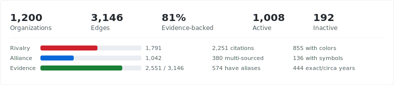

<div align="center">
    <p>
        <a href="https://github.com/kzndotsh/gang.guide/actions/workflows/ci.yml">
            </a>
        <a href="https://codecov.io/gh/kzndotsh/gang.guide">
            </a>
        <a href="https://github.com/kzndotsh/gang.guide/releases">
            </a>
        <a href="https://svelte.dev">
            </a>
        <a href="https://workers.cloudflare.com">
            </a>
        <a href="https://konvajs.org">
            </a>
        <a href="https://python.org">
            </a>
    </p>
</div>


<div align="center">
    <h1>gang.guide</h1>
    <p><strong>Evidence backed mapping of criminal organizations across the US — alliances, rivalries, history, and culture.</strong></p>
    <p>
        <a href="https://gang.guide">🌐 Live Site</a> •
        <a href="#quick-start">🚀 Quick Start</a> •
        <a href="docs/ARCHITECTURE.md">🏗️ Architecture</a> •
        <a href="docs/PIPELINE.md">⚙️ Pipeline</a> •
        <a href="TODO.md">🗺️ Roadmap</a>
    </p>
</div>

---

## Quick Start

```bash
# Clone and setup
git clone https://github.com/kzndotsh/gang.guide.git
cd gang.guide
just setup

# Or manually:
npm install
cd apps/web && npm install
python3 build.py

# Run the dev server
just dev
```

## How It Works

**Pipeline**:
1. **Scrape** — raw HTML from sources into `data/raw/`
2. **Clean** — strip HTML to plaintext
3. **Extract** — sonnet 4.5 at 3 temperatures (0.1, 0.3, 0.7) produces structured JSON with edges + evidence quotes
4. **Adjudicate** — opus 4.6 validates evidence, resolves conflicts, filters hallucinations
5. **Merge** — algorithmic consensus (2/3 agreement) or adjudicated result
6. **Apply** — conservative upgrade to `data/orgs/*.json` + `data/edges.json`, lint gates the result
7. **Build** — `build.py` compiles flat files into `graph.json` + `details.json`
8. **Serve** — SvelteKit + Konva.js canvas, deployed to Cloudflare Workers

## Project Structure

```
├── build.py                    # Builds graph.json + details.json from flat data
├── data/
│   ├── orgs/                   # One JSON per org (source of truth)
│   ├── edges.json              # Edge list (alliances, rivalries, affiliations)
│   └── lanes.json              # Lane taxonomy + org anchors
├── apps/
│   ├── web/                    # SvelteKit + Konva.js Canvas map viewer
│   │   ├── src/routes/         # +page.svelte (main map), sitemap.xml
│   │   ├── src/lib/map/        # KonvaMap.svelte, visibility.ts, scale.ts
│   │   ├── src/lib/inspector/  # Inspector panel components
│   │   └── alchemy.run.ts      # Deployment config (Cloudflare Workers)
│   └── pipeline/               # Python LLM extraction pipeline
│       ├── extract.py          # Multi-temp extraction (sonnet 4.5)
│       ├── adjudicate.py       # Conflict resolution (opus 4.6)
│       ├── merge.py            # Consensus filtering
│       ├── apply.py            # Conservative data upgrade
│       ├── lint.py             # Data validation (runs in CI)
│       └── tests/              # Unit tests + e2e + fixtures
├── .ruler/                     # AI agent instructions (source of truth)
├── .github/workflows/          # CI + release + PR title validation
├── justfile                    # Task runner (just dev, just ci, just pipeline)
├── pytest.ini                  # Test config (strict markers, coverage)
├── lefthook.yml                # Git hooks (ruff pre-commit, svelte-check pre-push)
├── flake.nix                   # Nix dev shell
├── TODO.md                     # Roadmap
└── docs/                       # Documentation
    ├── ARCHITECTURE.md         # System design
    ├── PIPELINE.md             # LLM extraction pipeline
    ├── SCHEMA.md               # Data schema reference
    ├── TERMINOLOGY.md          # Glossary
    ├── USER.md                 # User guide
    └── CONTRIBUTING.md         # Contributor guide
```

## Data

Stats are computed at build time by `build.py` and embedded in `graph.json`.

| Source | Coverage |
|--------|----------|
| [Wikipedia](https://en.wikipedia.org) | Gang articles, infoboxes, category pages |
| [StreetGangs.com](https://www.streetgangs.com) | LA gang profiles, colors, territories |
| [UnitedGangs.com](https://unitedgangs.com) | Org profiles, alliances, rivalries |
| [Chicago Gang History](https://chicagoganghistory.com) | Detailed Chicago set histories |
| [DetroitStreetGangs](https://detroitstreetgangs.com) | Detroit gang profiles, rivalries, affiliations |
| [DOJ / FBI](https://www.justice.gov) | Gang threat assessments, RICO cases |
| [BlackPast.org](https://www.blackpast.org) | Historical context, civil rights era gangs |
| [CourtListener](https://www.courtlistener.com) | Gang-enhancement court filings |
| [NGCRC](https://www.ngcrc.com) | National Gang Crime Research Center |

<!-- STATS:START - Auto-generated by scripts/update-readme-stats.py -->

<!-- STATS:END -->

## Tech Stack

| Component | Technology |
|-----------|------------|
| **Data** | Flat JSON files, Python build script |
| **Frontend** | SvelteKit 5, Konva.js, Tailwind CSS, shadcn-svelte |
| **Rendering** | Raw Konva Canvas API (4-layer architecture) |
| **Deployment** | Cloudflare Workers via Alchemy IaC |
| **Pipeline** | Python, sonnet 4.5 + opus 4.6 (LLM extraction) |
| **Linting** | Ruff (Python), svelte-check (frontend) |
| **Testing** | pytest + vitest, codecov coverage |
| **CI/CD** | GitHub Actions, conventional commits, lefthook |

## Commands

```bash
just              # list all tasks
just setup        # bootstrap after cloning
just dev          # start dev server
just build-data   # rebuild graph.json from org files
just lint         # lint data integrity
just check        # type-check frontend
just deploy       # deploy to production
just ruler        # regenerate AI agent configs
```

## Adding a New Org

1. Create `data/orgs/my-new-org.json`:
```json
{
  "id": "org:my-new-org",
  "name": "My New Org",
  "aliases": [],
  "type": "street_gang",
  "lane": "california-latino-other",
  "metro": "Los Angeles",
  "founded_year": 1985,
  "founded_year_precision": "circa",
  "description": "Factual 1-3 sentence description with founding context.",
  "colors": ["blue"],
  "nation_affiliation": null,
  "status": "active",
  "sources": [{"url": "https://...", "title": "Source Name"}]
}
```
2. Add relationships to `data/edges.json` if needed
3. Run `just build-data`

## Deployment

Deployed to Cloudflare Workers via [Alchemy](https://github.com/alchemy-run/alchemy).

```bash
just deploy           # production
just deploy-preview   # personal stage
```

Requires `apps/web/.env` with `ALCHEMY_PASSWORD`, `CLOUDFLARE_API_TOKEN`, `CLOUDFLARE_ACCOUNT_ID`.

## AI Agent Setup

Instructions managed via [Ruler](https://github.com/intellectronica/ruler). After cloning:

```bash
just ruler
```

This generates config files for Claude, Copilot, Cursor, and Kiro from `.ruler/AGENTS.md`.

## License

TBD

## Contributors


Created by [@kzndotsh](https://github.com/kzndotsh)

## Project Stats


