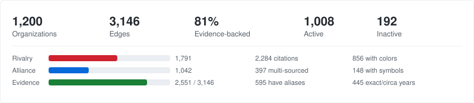

<div align="center">
    <p>
        <a href="https://github.com/kzndotsh/gang.guide/actions/workflows/ci.yml">
            </a>
        <a href="https://codecov.io/gh/kzndotsh/gang.guide">
            </a>
        <a href="https://github.com/kzndotsh/gang.guide/releases">
            </a>
        <a href="https://svelte.dev">
            </a>
        <a href="https://workers.cloudflare.com">
            </a>
        <a href="https://konvajs.org">
            </a>
        <a href="https://python.org">
            </a>
    </p>
</div>


<div align="center">
    <h1>gang.guide</h1>
    <p><strong>Map of US criminal organizations: alliances, rivalries, history, sources.</strong></p>
    <p>
        <a href="https://gang.guide">Live site</a> •
        <a href="#quick-start">Quick start</a> •
        <a href="docs/INDEX.md">Docs</a> •
        <a href="docs/ARCHITECTURE.md">Architecture</a> •
        <a href="docs/PIPELINE.md">Pipeline</a> •
        <a href="docs/SCHEMA.md">Schema</a> •
        <a href="TODO.md">Roadmap</a>
    </p>
</div>

---

## Quick start

```bash
# Clone and setup
git clone https://github.com/kzndotsh/gang.guide.git
cd gang.guide
just setup

# Or manually:
npm install
cd apps/web && npm install
python3 build.py

# Run the dev server
just dev
```

## How it works
Scrape → Extract (sonnet 4.6 × 3 temps) → Adjudicate → Merge → Apply → Build → Serve

1. **Scrape** raw text into `data/raw/{source}/{slug}/content.txt`
2. **Extract** structured JSON via sonnet 4.6 at 3 temperatures: edges need verbatim evidence quotes
3. **Adjudicate** with sonnet 4.6: validates evidence, rejects co-mentions, resolves conflicts
4. **Merge** uses `adjudicated.json` when present, otherwise 2/3 consensus
5. **Apply** conservative upgrade to `data/orgs/*.json` + `data/edges.json`: lint gates the result
6. **Build** compiles flat files into `graph.json` + `details.json`
7. **Serve** on Cloudflare Workers via SvelteKit + Konva.js canvas

`just pipeline <source>` runs extract → adjudicate → merge → apply dry-run. **Verify** (`just verify`) is a separate web-search pass; merge does not read `verified.json`. **Enrich** / **clean** (`just enrich`, `just clean`) fill and spot-check org profiles; they are not in that recipe.

Details: [docs/PIPELINE.md](docs/PIPELINE.md).

## Data

`build.py` writes counts into `graph.json`. [Lint](docs/STANDARDS.md) runs in CI and after pipeline apply. Extracted edges are supposed to carry a verbatim quote from the source page.

**Sources:**

| | | | |
|---|---|---|---|
| [Wikipedia](https://en.wikipedia.org) | [StreetGangs.com](https://www.streetgangs.com) | [UnitedGangs.com](https://unitedgangs.com) | [Chicago Gang History](https://chicagoganghistory.com) |
| [DetroitStreetGangs](https://detroitstreetgangs.com) | [NGCRC](https://www.ngcrc.com) | [NewYorkCityGangs](https://newyorkcitygangs.com) | [StoneGreasers](https://www.stonegreasers.com) |
| [DOJ](https://www.justice.gov) | [BlackPast.org](https://www.blackpast.org) | [CourtListener](https://www.courtlistener.com) | [StopHoustonGangs](https://stophoustongangs.org) |
| [ADL](https://www.adl.org) | [FBI NGTA](https://www.fbi.gov/how-we-can-help-you/need-an-fbi-service-or-more-information/library/gang-reports) | [Gang Enforcement](https://www.gangenforcement.com) | [NAGIA](https://www.nagia.org) |

<!-- STATS:START - Auto-generated by scripts/update-readme-stats.py -->

<!-- STATS:END -->

## Tech stack

| Component | Technology |
|-----------|------------|
| **Data** | Flat JSON files, Python build script |
| **Frontend** | SvelteKit 5, Konva.js, Tailwind CSS, shadcn-svelte |
| **Rendering** | Raw Konva Canvas API (persistent nodes, edge-index, directional arrows) |
| **Deployment** | Cloudflare Workers via Alchemy IaC |
| **Pipeline** | Python, claude-sonnet-4.6 (LLM extraction) |
| **Linting** | Ruff (Python), svelte-check (frontend) |
| **Testing** | pytest + vitest, codecov coverage |
| **CI/CD** | GitHub Actions, conventional commits, lefthook |

## Project structure

```
├── build.py                    # Builds graph.json + details.json from flat data
├── data/
│   ├── orgs/                   # One JSON per org (source of truth)
│   ├── edges.json              # Edge list (alliances, rivalries, affiliations)
│   ├── lanes.json              # Lane taxonomy + org anchors
│   └── logs/                   # Pipeline structured logs (JSONL)
├── apps/
│   ├── web/                    # SvelteKit + Konva.js Canvas map viewer
│   │   ├── src/routes/         # +page.svelte (main map), sitemap.xml
│   │   ├── src/lib/map/        # KonvaMap.svelte, visibility.ts, scale
│   │   ├── src/lib/inspector/  # Inspector panel
│   │   └── alchemy.run.ts      # Cloudflare Workers (Alchemy)
│   └── pipeline/               # Python LLM extraction pipeline
│       ├── extract.py          # Multi-temp extraction (sonnet 4.6)
│       ├── adjudicate.py       # Conflict resolution (sonnet 4.6)
│       ├── verify.py           # Optional web-search fact-checking
│       ├── merge.py            # Consensus / adjudicated copy
│       ├── apply.py            # Conservative data upgrade
│       ├── enrich.py / clean.py
│       ├── ignore.py           # .gangguideignore
│       ├── log.py / lint.py
│       └── scrape/             # Source scrapers
├── .ruler/                     # AI agent instructions (source of truth)
├── justfile                    # Task runner
├── flake.nix                   # Nix dev shell
├── TODO.md / IDEA.md           # Roadmap + research notes
└── docs/                       # [INDEX.md](docs/INDEX.md): architecture, pipeline, schema, ...
```

## Commands

```bash
just              # list all tasks
just setup        # bootstrap after cloning
just dev          # start dev server
just build-data   # rebuild graph.json from org files
just lint         # lint data integrity
just check        # type-check frontend
just test-all     # pytest + vitest
just ci           # full local CI
just deploy       # production
just deploy-preview
just pipeline chicago_history   # extract → adjudicate → merge → apply dry-run
just verify chicago_history     # optional web-search pass
just enrich / just enrich-rank
just clean / just clean-rank
just ruler        # regenerate AI agent configs from .ruler/
```

## Adding a new org

Follow [docs/CONTRIBUTING.md](docs/CONTRIBUTING.md). Fields: [docs/SCHEMA.md](docs/SCHEMA.md). Then `just lint` and `just build-data`.

## Deployment

Deployed to Cloudflare Workers via [Alchemy](https://github.com/alchemy-run/alchemy).

```bash
just deploy           # production
just deploy-preview   # personal stage
```

Requires `apps/web/.env` with `ALCHEMY_PASSWORD`, `CLOUDFLARE_API_TOKEN`, `CLOUDFLARE_ACCOUNT_ID`.

## AI agent setup

Instructions managed via [Ruler](https://github.com/intellectronica/ruler). After cloning:

```bash
just ruler
```

This generates config files for Claude, Copilot, Cursor, and Kiro from `.ruler/AGENTS.md`.

## License

TBD

## Contributors


Created by [@kzndotsh](https://github.com/kzndotsh)

## Project stats


